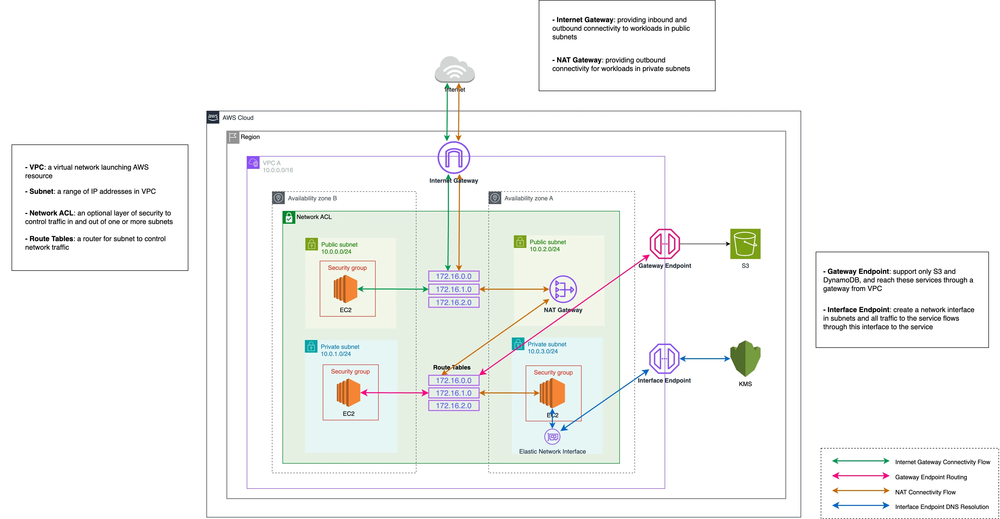

docker build \<ruta fichero> 

aws sts get-caller-identity saber usuario con el que esta haciendo pedidos a la API

- aws eks help
- aws eks list_cluster --region eu-west-1
- aws eks describe cluster --name \<clustername>
- aws eks update-kubeconfig --name \<clustername>