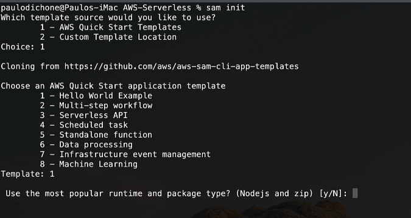

# AWS SAM

- AWS SAM (serverless application Model)
- Used to define your serverless application
- AWS SAM consists of the  following components
    - **AWS SAM Template Specification** you write properties to a file to describe functions, APIs, permissions, etc
    - **AWS SAM CLI** to invoke function, packages and deploy serverless applications to AWS cloud and so on
- AWS SAM CLI aims to ease the pain of creating, deplying, managing and debugging lambda functions
- It integrates well with CI/CD tools
- You use SAM to define and configure your serverless applications using a yaml template

## SAM benefits

- single deployment configuration deploy the whole stack as a single entity
- extension of AWS Cluodformation reliable cloudformation stack deployment
- built in best practices use AWS SAM to define and deploy your infraestructure as config
- deep integration with development tools
- local debugging and testing

## AWS SAM hello world

sam init

sam build

sam local invoke #need docker is running

sam deploy --guided

sam local start-api

sam local invoke  "name_fuction" -e events/event.json

clean all

aws cloudformation delete-stack --stack-name sam-app --region us-east-1

