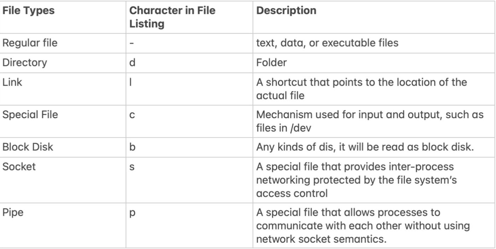
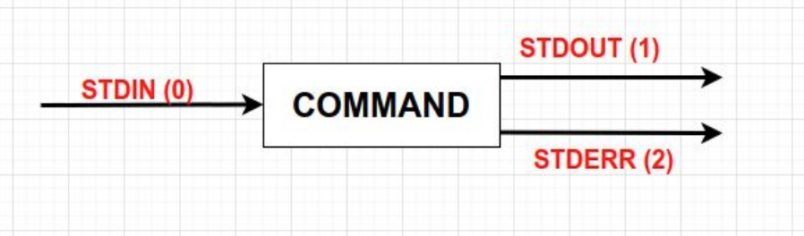
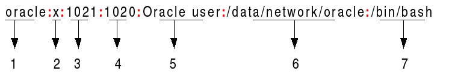
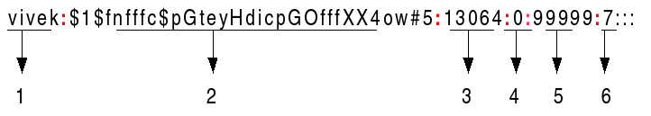
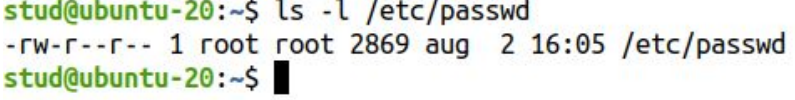

# LINUX

# Commands - Getting Help
```
##########################
## Getting Help in Linux
##########################
 
# MAN Pages
man command     # => Ex: man ls
 
# The man page is displayed with the less command
# SHORTCUTS:
# h         => getting help
# q         => quit
# enter     => show next line
# space     => show next screen
# /string   => search forward for a string
# ?string   => search backwards for a string
# n / N     => next/previous appearance
 
# checking if a command is shell built-in or executable file
type rm        # => rm is /usr/bin/rm
type cd        # => cd is a shell builtin
 
# getting help for shell built-in commands
help command    # => Ex: help cd
command --help  # => Ex: rm --help
 
# searching for a command, feature or keyword in all man Pages
man -k uname
man -k "copy files"
apropos passwd
```


# Keyboard Shortcuts
```
##########################
TAB  # autocompletes the command or the filename if its unique
TAB TAB (press twice)   # displays all commands or filenames that start with those letters
 
# clearing the terminal
CTRL + L
 
# closing the shell (exit)
CTRL + D
 
# cutting (removing) the current line 
CTRL + U
 
# moving the cursor to the start of the line
CTRL + A
 
# moving the cursor to the end of the line
Ctrl + E
 
# stopping the current command
CTRL + C
 
# sleeping a the running program
CTRL + Z
 
# opening a terminal 
CTRL + ALT + T
```

# Bash History
```
 
# showing the history
history
 
# removing a line (ex: 100) from the history
history -d 100
 
# removing the entire history
history -c
 
# printing the no. of commands saved in the history file (~/.bash_history)
echo $HISTFILESIZE
 
# printing the no. of history commands saved in the memory
echo $HISTSIZE
 
# rerunning the last command from the history
!!
 
# running  a specific command from the history (ex: the 20th command)
!20
 
# running the last nth (10th) command from the history
!-10
 
# running the last command starting with abc 
!abc
 
# printing the last command starting with abc 
!abc:p
 
# reverse searching into the history
CTRL + R
 
# recording the date and time of each command in the history
HISTTIMEFORMAT="%d/%m/%y %T"
 
# making it persistent after reboot
echo "HISTTIMEFORMAT=\"%d/%m/%y %T\"" >> ~/.bashrc
# or
echo 'HISTTIMEFORMAT="%d/%m/%y %T"' >> ~/.bashrc
```

## WSL 

wsl --user root
You should be logged in as root into your WSL. Now, use the passwd command to change the password for your user:

passwd username
Replace username with your actual Linux username.

https://askubuntu.com/questions/1365074/trying-to-use-sudo-in-wsl-but-my-microsoft-account-which-im-logged-into-as-adm

# Getting root Access

On Linux there are 2 main categories of users:
1. non-privileged users - have no special rights on the system.
2. The root user (superuser or the administrator).

● Root privileges are the powers that the root account has on the system. The root
account is the most privileged on the system and has absolute power over it.

● Root exists on any Linux system is there’s only one.

● It’s not recommended to use root for ordinary tasks. When root permissions are needed
you simply become root only to perform that particular administrative task.

## Running commands as root (sudo, su)
```
 
# running a command as root (only users that belong to sudo group [Ubuntu] or wheel [CentOS])
sudo command
 
# becoming root temporarily in the terminal
sudo su      # => enter the user's password
 
# setting the root password
sudo passwd root
 
# changing a user's password
passwd username
 
# becoming root temporarily in the terminal
su     # => enter the root password
```

# The Linux File System

● A file system controls how data is stored and retrieved.
● Each group of data is called a file and the structure and the logic rules used to manage
files and their names are called file systems.
● A file system is a logical collection of files on a partition or disk.
● On a Linux system, everything is considered to be a file.
● On Linux file and directory names are case-sensitive.

# The Filesystem Hierarchy Standard

● /bin contains binaries or user executable files which are available to all users.
● /sbin contains applications that only the superuser (hence the initial s) will need.
● /boot contains files required for starting your system.
● /home is where you will find your users’ home directories. Under this directory there is another
directory for each user, if that particular user has a home directory.
root has its home directory separated from the rest of the users’ home directories and is /root
● /dev contains device files.
● /etc contains most, if not all system-wide configuration files.
● /lib contains shared library files used by different applications.
● /media is used for external storage will be automatically mounted.
● /mnt is like /media but it’s not very often used these days
● /tmp contains temporary files, usually saved there by applications that are running.
Non-privileged users may also store files here temporarily.
● /proc is a virtual directory. It contains information about your computer hardware, such as
information about your CPU, RAM memory or Kernel. The files and directories are generated
when your computer starts, or on the fly, as your system is running and things change.
● /sys contains information about devices, drivers, and some kernel features.
● /srv contains data for servers.
● /run is a temporary file system which runs in RAM.
● /usr contains many other subdirectories binaries files, shared libraries and so on. On some
distributions like CentOS many commands are saved in /usr/bin and /usr/sbin instead of /bin
and /sbin.
● /var typically contains variable-length files such as logs which are files that register events that
happen on the system.

# Linux Paths
```
 
.       # => the current working directory
..      # => the parent directory
~       # => the user's home directory
 
cd      # => changing the current directory to user's home directory
cd ~    # => changing the current directory to user's home directory
cd -    # => changing the current directory to the last directory
cd /path_to_dir    # => changing the current directory to path_to_dir 
pwd     # => printing the current working directory


# installing tree
sudo apt install tree
 
tree directory/     # => Ex: tree .
tree -d .           # => prints only directories
tree -f .           # => prints absolute paths
```

# The ls Command
```
## ls [OPTIONS] [FILES]

##########################


# listing the current directory

# ~ => user's home directory

# . => current directory

# .. => parent directory

ls

ls .


# listing more directories

ls ~ /var /


# -l => long listing

ls -l ~


# -a => listing all files and directories including hidden ones

ls -la ~


# -1 => listing on a single column

ls -1 /etc


# -d => displaying information about the directory, not about its contents

ls -ld /etc


# -h => displaying the size in human readable format

ls -h /etc


# -S => displaying sorting by size

ls -Sh /var/log


# Note: ls does not display the size of a directory and all its contents. Use du instead

du -sh ~


# -X => displaying sorting by extension

ls -lX /etc


# --hide => hiding some files

ls --hide=*.log /var/log


# -R => displaying a directory recursively

ls -lR ~


# -i => displaying the inode number

ls -li /etc

```

# File Timestamps

Every file on Linux has three timestamps:
1. The access timestamp or atime is the last time the file was read (ls -lu)
2. The modified timestamp or mtime is the last time the contents of the file was modified
(ls -l, ls -lt)
3. The changed timestamp ctime is the last time when some metadata related to the file
was changed (ls -lc)

# File Types linux

File Types: Regular file(), Dictionary(/), Link(@), Character, Disk, Socket(=), Pipe(|)




# File Timestamps and Date

```
 
# displaying atime
ls -lu
 
# displaying mtime
ls -l
ls -lt
 
# displaying ctime
ls -lc
 
# displaying all timestamps
stat file.txt
 
# displaying the full timestamp
ls -l --full-time /etc/
 
# creating an empty file if it does not exist, update the timestamps if the file exists
touch file.txt
 
# changing only the access time to current time
touch -a file
 
# changing only the modification time to current time
touch -m file
 
# changing the modification time to a specific date and time
touch -m -t 201812301530.45 a.txt
 
# changing both atime and mtime to a specific date and time
touch -d "2010-10-31 15:45:30" a.txt
 
# changing the timestamp of a.txt to those of b.txt
touch a.txt -r b.txt
 
# displaying the date and time
date
 
# showing this month's calendar
cal
 
# showing the calendar of a specific year
cal 2021
 
# showing the calendar of a specific month and year
cal 7 2021
 
# showing the calendar of previous, current and next month
cal -3
 
# setting the date and time
date --set="2 OCT 2020 18:00:00"
 
# displaying the modification time and sorting the output by name.
ls -l
 
# displaying the output sorted by modification time, newest files first
ls -lt
 
# displaying and sorting by atime
ls -ltu
 
# reversing the sorting order
ls -ltu --reverse
```

# Viewing files (cat, less, more, head, tail, watch)

```
 
# displaying the contents of a file
cat filename
 
# displaying more files
cat filename1 filename2
 
# displaying the line numbers
can -n filename
 
# concatenating 2 files
cat filename1 filename2 > filename3
 
# viewing a file using less
less filename
 
# less shortcuts:
# h         => getting help
# q         => quit
# enter     => show next line
# space     => show next screen
# /string   => search forward for a string
# ?string   => search backwards for a string
# n / N     => next/previous appearance
 
 
# showing the last 10 lines of a file
tail filename
 
# showing the last 15 lines of a file
tail -n 15 filename
 
# showing the last lines of a file starting with line no. 5
tail -n +5 filename
 
# showing the last 10 lines of the file in real-time
tail -f filename
 
 
# showing the first 10 lines of a file
head filename
 
# showing the first 15 lines of a file
head -n 15 filename
 
# running repeatedly a command with refresh of 3 seconds
watch -n 3 ls -l

```

# Working with files and directory (touch, mkdir, cp, mv, rm, shred)
```
 
# creating a new file or updating the timestamps if the file already exists
touch filename
 
# creating a new directory
mkdir dir1
 
# creating a directory and its parents as well
mkdir -p mydir1/mydir2/mydir3
 
######################
### The cp command ###
######################
# copying file1 to file2 in the current directory
cp file1 file2
 
# copying file1 to dir1 as another name (file2)
cp file1 dir1/file2
 
# copying a file prompting the user if it overwrites the destination
cp -i file1 file2
 
# preserving the file permissions, group and ownership when copying
cp -p file1 file2
 
# being verbose
cp -v file1 file2
 
# recursively copying dir1 to dir2 in the current directory
cp -r dir1 dir2/
 
# copy more source files and directories to a destination directory
cp -r file1 file2 dir1 dir2 destination_directory/
 
 
######################
### The mv command ###
######################
# renaming file1 to file2
mv file1 file2
 
# moving file1 to dir1 
mv file1 dir1/
 
# moving a file prompting the user if it overwrites the destination file
mv -i file1 dir1/
 
# preventing a existing file from being overwritten
mv -n file1 dir1/
 
# moving only if the source file is newer than the destination file or when the destination file is missing
mv -u file1 dir1/
 
# moving file1 to dir1 as file2
mv file1 dir1/file2
 
# moving more source files and directories to a destination directory
mv file1 file2 dir1/ dir2/ destination_directory/
 
######################
### The rm command ###
######################
# removing a file
rm file1
 
# being verbose when removing a file
rm -v file1
 
# removing a directory
rm -r dir1/
 
# removing a directory without prompting
rm -rf dir1/
 
# removing a file and a directory prompting the user for confirmation
rm -ri fil1 dir1/
 
# secure removal of a file (verbose with 100 rounds of overwriting)
shred -vu -n 100 file1

#SHRED 
Shred –help

Aquí listamos las opciones para ejecutar la herramienta:

• f: force. cambia los permisos del archivo si fuera necesario
• n: número de veces a sobrescribir el archivo o partición (3 veces por defecto). Cuanto mayor sea este número, más difícil será su recuperación
• u: trunca y elimina el archivo después de sobrescribirlo
• v: verbose o verborragico, muestra el progreso en pantalla
• z: zero, sobreescribe 0 para evitar dejar rastro

shred -n 10 -uvz <nombrearchivo o particion>

Con este comando se ejecuta la herramienta, borrando 10 veces el archivo (letra n), luego de el borrado del archivo sobrescribirlo (letra u), muestra el progreso del borrado en pantalla (letra v) y sobre escribe con 0 para evitar dejar rastros (letra z), todo esto seguido del archivo a eliminar, en este caso un documento de texto.
```

# Piping and Command Redirection
Every Linux command or program we run has three data streams connected to it:
1. STDIN (0) - Standard Input
2. STDOUT (1) - Standard Output
3. STDERR (2) - Standard Error



# Piping and Command Redirection
```
 
## Piping Examples:
 
ls -lSh /etc/ | head            # see the first 10 files by size
ps -ef | grep sshd              # checking if sshd is running
ps aux --sort=-%mem | head -n 3  # showing the first 3 process by memory consumption
 
## Command Redirection
 
# output redirection
ps aux > running_processes.txt
who -H > loggedin_users.txt
 
# appending to a file
id >> loggedin_users.txt
 
# output and error redirection
tail -n 10 /var/log/*.log > output.txt 2> errors.txt
 
# redirecting both the output and errors to the same file
tail -n 2 /etc/passwd /etc/shadow > output_errors.txt 2>&1
 
cat -n /var/log/auth.log | grep -ai "authentication failure" | wc -l
cat -n /var/log/auth.log | grep -ai "authentication failure" > auth.txt     # => piping and redirection
```
tee is for show bot in screen and create a file by default tee overwrite to appen you need to use -a option

who | tee -a m.txt 
ifconfig | grep ether | tee mac.txt

# # Finding Files (find, plocate)
```
 
## LOCATE ##
# locate is a symlink (shortcut) to plocate
 
# updating the plocate db
sudo updatedb
 
# finding file by name
locate filename # => filename is expanded to *filename*
locate -i filename # => the filename is case insensitive
locate -r '/filename$' # => finding by exact name
 
# finding using the basename
locate -b filename
 
# finding using regular expressions
locate -r 'regex'
 
# checking that the file exists
locate -e filename
 
# showing command path
which command
which -a command
 
 
## FIND ##
find PATH OPTIONS
 
# Example: find ~ -type f -size +1M # => finding all files in ~ bigger than 1 MB
 
## Options:
# -type f, d, l, s, p 
# -name filename
# -iname filename # => case-insensitive
# -size n, +n, -n
# -perm permissions
# -links n, +n, -n
# -atime n, -mtime n, ctime n
# -user owner
# -group group_owner


example

find . -name "todo*"
find . -name "*re*"
find . -name todo.txt -delete
find . -type d -maxdepth 2 -perm 755
sudo find . -type f size +5M - size -10M -ls

# Exec

diplay the contect all the files

sudo find /etc -type f -mtime 0 -exec cat {} \;

make backuo files modify last 7 days

sudo find /etc/ -mtime -7 -type f -exec cp {} /root/backup \;

sudo find /etc/ -mtime -7 -type f -ok cp {} /root/backup \; # ask in the interactive way

```

# Searching for text patterns (grep)

``` 
grep [OPTIONS] pattern file
 
Options:
-n          # => print line number
-i          # => case insensitive
-v          # inverse the match
-w          # search for whole words
-a          # search in binary files
-R          # search in directory recursively
-c          # display only the no. of matches
-C n        # display a context (n lines before and after the match)
 
 
# printing ASCII chars from a binary file
strings binary_file
```

# etc/passwd

 file stores essential information required during login. In other words, it stores user account information

 The /etc/passwd contains one entry per line for each user (user account) of the system. All fields are separated by a colon (:) symbol. Total of seven fields as follows. Generally, /etc/passwd file entry looks as follows:



1. Username: It is used when user logs in. It should be between 1 and 32 characters in length.
2. Password: An x character indicates that encrypted and salted password is stored in /etc/shadow file. Please note that you need to use the passwd command to computes the hash of a password typed at the CLI or to store/update the hash of the password in /etc/shadow file.
3. User ID (UID): Each user must be assigned a user ID (UID). UID 0 (zero) is reserved for root and UIDs 1-99 are reserved for other predefined accounts. Further UID 100-999 are reserved by system for administrative and system accounts/groups.
4. Group ID (GID): The primary group ID (stored in /etc/group file)
5.User ID Info (GECOS): The comment field. It allow you to add extra information about the users such as user’s full name, phone number etc. This field use by finger command.
6. Home directory: The absolute path to the directory the user will be in when they log in. If this directory does not exists then users directory becomes /
7. Command/shell: The absolute path of a command or shell (/bin/bash). Typically, this is a shell. Please note that it does not have to be a shell. For example, sysadmin can use the nologin shell, which acts as a replacement shell for the user accounts. If shell set to /sbin/nologin and the user tries to log in to the Linux system directly, the /sbin/nologin shell closes the connection.

# /etc/shadow 

Is a text-based password file. The shadow file stores the hashed passphrase (or “hash”) format for Linux user account with additional properties related to the user password. This shadow file is directly accessible only to the root user. However, some commands or programs (e.g., su, passwd, and others) with unique SetUID (SUID) are set on them to grant them access to the shadow file. Understanding /etc/shadow file format is essential for sysadmins and developers to debug user account issues. Hence, we are going to learn about it.

Basically, the /etc/shadow file stores secure user account information. All fields are separated by a colon (:) symbol. It contains one entry per line for each user listed in /etc/passwd file. Generally, shadow file entry looks as follows (click to enlarge image):



1. Username : A valid account name, which exist on the system.
2. Password : Your encrypted password is in hash format. The password should be minimum 15-20 characters long including special characters, digits, lower case alphabetic and more. Usually password format is set to $id$salt$hashed, The $id is the algorithm prefix used On GNU/Linux as follows
    $1$ is MD5
    $2a$ is Blowfish
    $2y$ is EksBlowfish
    $5$ is SHA-256
    $6$ is SHA-512
    $y$ is yescrypt
3. Last password change (lastchanged) : The date of the last password change, expressed as the number of days since Jan 1, 1970 (Unix time). The value 0 has a special meaning, which is that the user should change her password the next time she will log in the system. An empty field means that password aging features are disabled.
4. Minimum : The minimum number of days required between password changes i.e. the number of days left before the user is allowed to change her password again. An empty field and value 0 mean that there are no minimum password age.
5. Maximum : The maximum number of days the password is valid, after that user is forced to change her password again.
6. Warn : The number of days before password is to expire that user is warned that his/her password must be changed
7. Inactive : The number of days after password expires that account is disabled.
8. Expire : The date of expiration of the account, expressed as the number of days since Jan 1, 1970.

# Groups

There are two types of groups that a user can belong to:
1. The primary group: the id is stored in /etc/passwd and the group name in /etc/group
2. Secondary groups: stored in /etc/group
tail -n 3 /etc/group
geoclue:x:127:
pulse:x:128:
pulse-access:x:129:
gdm:x:130:
lxd:x:131:student, john
student:x:1000:

  The /etc/login.defs file defines the site-specific configuration
       for the shadow password suite.

# File Permissions 

● File permissions (file modes) specify who can access, change or execute a file on a
Linux System.
● It ensures that only authorized users and processes can access files and directories.
● Each file or directory has an owner and a group. By default, the owner is the user who
creates the file and the group is the primary group of that user.
● The ownership of a file or a directory can be changed only by root using the chown and
chgrp commands.
For each file the permissions are assigned to three different categories of users:
1. The file owner.
2. The group owner.
3. Others (anyone else or the whole world).

There are three file permissions types that apply to each category:
● The read permission (r)
● The write permission (w)
● The execute permission (x)
To view the files permission run: ls -l or stat.



# The Octal Notation
● The number that represents the permission in base-8 can be a either a 3 or a 4-digit
number with digits from 0 to 7. The leading zero (0) can be omitted.
● 0755 = 755 and 0644 = 644.
● When a 3 digit number is used, the first digit represents the permissions of the file’s
owner, the second one the file’s group, and the last one the permissions of the others
class.
● r, w, and x have their own fixed number value:
○ r (read) = 4
○ w (write) = 2
○ x (execute) = 1
○ - (no permissions) = 0
○ The permissions number of a specific user class is represented by the sum of the
values of the permissions for that group.

# Changing File Permissions (chmod)
● chmod is the command used to change the permissions of a file or a directory using
either the symbolic or the numeric notation.
● Only the root, or the file’s owner, can change the file’s permissions.
chmod [who][OPERATION][permissions] filename

who signifies the user category whose permissions will be changed.
● u: the user that owns the file.
● g: the group that the file belongs to.
● o: the other users.
 The OPERATION flags define whether the permissions are to be removed, added, or set:
● - : a hyphen means remove the specified permissions.
● + : the plus sign means Add the specified permissions.
● = : equals means change the current permissions to the specified permissions.
The permissions are specified using the letters r, w and x.

# Changing File Ownership (chown, chgrp)
● In Linux, all files are associated with an owner and a group owner.
● The chown and chgrp commands are used to change the files owner and group.
● Only root can change the file owner.
● Normal users can change the group of the file only if they own the file and only to a
group of which they are a member of. root can change the group ownership of all files.
ls -l hello.c
-rw-r--r-- 1 root root 81 iul 18 12:49 hello.c
chown james hello.c
ls -l hello.c
-rw-r--r-- 1 james root 81 iul 18 12:49 hello.c
chgrp adm hello.c
ls -l hello.c
-rw-r--r-- 1 james adm 81 iul 18 12:49 hello.c

# Special Permissions - SUID (Set User ID)
● Besides r, w and x for the owner, group and others there are 3 extra special permissions
for each file or directory: SUID or Set User ID, SGID or Set Group ID and Sticky Bit.
● These special permissions are for a file or directory overall, not just for a user category.
● When an executable file with SUID is executed then the resulting process will have the
permissions of the owner of the command, not the permissions of the user who
executes the command.
Setting SUID:
● Absolute Mode: chmod 4XXX file
● Relative Mode: chmod u+s file
 ls -l /usr/bin/passwd
-rwsr-xr-x 1 root root 68208 apr 16 15:36 /usr/bin/passwd

# Special Permissions - SGID (Set Group ID)
● SGID is set mainly to directories.
● If you set SGID on directories, all files or directories created inside that directory will be
owned by the same group owner of the directory where SGID was configured.
● This is useful in creating shared directories, which are directories that are writable at
the group level.
Setting SGID:
● Absolute Mode: chmod 2XXX directory
● Relative Mode: chmod g+s directory
 ls -ld /programming/
drwxrws--- 2 pr1 programmers 4096 iul 14 13:15 /programming/

# Special Permissions - The Sticky Bit
● The Sticky Bit is applied to directories.
● A user may only delete files that he owns or for which he has explicit write permission
granted, even when he has write access to the directory.
● The sticky bit allows you to create a directory that everyone can use as a shared file
storage. The files are protected because, no one can delete anyone else’s files.
Setting the sticky bit:
● Absolute Mode: chmod 1XXX directory
● Relative Mode: chmod o+t directory
 ls -ld /temp/
drwxrwxrwt 2 root root 4096 iul 14 13:45 /temp/

# Umask

The umask acts as a set of permissions that applications cannot set on files. It's a file mode creation mask for processes and cannot be set for directories itself. Most applications would not create files with execute permissions set, so they would have a default of 666, which is then modified by the umask.

0666 for files default values
0777 for directories default values

beacuse UMASK = 0002
0777-0002=0775
0666-0002=0664

# lsattr and chattr

El omando chattr, comando no muy conocido, que sirve para cambiar los atributos de un archivo en un sistema GNU/Linux. 

Además es genial ya que proporciona más seguridad a nuestros archivos, frente a cambios y eliminaciones no deseados.

El operador + hace que los atributos seleccionados se agreguen a los atributos existentes de los archivos; - hace que se eliminen; y = hace que sean los únicos atributos que tienen los archivos.

Las letras aAcCdDeFijPsStTu seleccionan los nuevos atributos para los archivos: anexar solo (a), sin actualizaciones temporales (A), comprimido (c), sin copia al escribir (C), sin volcado (d), actualizaciones de directorio sincrónicas (D), formato de extensión (e), búsquedas de directorio que no distinguen entre mayúsculas y minúsculas (F), inmutable (i), registro de datos (j), jerarquía del proyecto (P), seguro eliminación (e), actualizaciones síncronas (S), sin fusión de cola (t), parte superior de la jerarquía de directorios (T) e indeleble (u)

Los siguientes atributos son de solo lectura y pueden ser enumerados por lsattr pero no modificados por chattr: cifrado (E), directorio indexado (I) y datos en línea (N).

# File Permissions
``` 
## LEGEND
u = User
g = Group
o = Others/World
a = all
 
r = Read
w = write
x = execute
- = no access
 
# displaying the permissions (ls and stat)
ls -l /etc/passwd
    -rw-r--r-- 1 root root 2871 aug 22 14:43 /etc/passwd
 
stat /etc/shadow
    File: /etc/shadow
    Size: 1721      	Blocks: 8          IO Block: 4096   regular file
    Device: 805h/2053d	Inode: 524451      Links: 1
    Access: (0640/-rw-r-----)  Uid: (    0/    root)   Gid: (   42/  shadow)
    Access: 2020-08-24 11:31:49.506277118 +0300
    Modify: 2020-08-22 14:43:36.326651384 +0300
    Change: 2020-08-22 14:43:36.342652202 +0300
    Birth: -
 
# changing the permissions using the relative (symbolic) mode
chmod u+r filename
chmod u+r,g-wx,o-rwx filename
chmod ug+rwx,o-wx filename
chmod ugo+x filename
chmod a+r,a-wx filename
 
# changing the permissions using the absolute (octal) mode
PERMISSIONS      EXAMPLE
u   g   o
rwx rwx rwx     chmod 777 filename
rwx rwx r-x     chmod 775 filename
rwx r-x r-x     chmod 755 filename
rwx r-x ---     chmod 750 filename
rw- rw- r--     chmod 664 filename
rw- r-- r--     chmod 644 filename
rw- r-- ---     chmod 640 filename
 
# setting the permissions as of a reference file
chmod --reference=file1 file2
 
# changing permissions recursively
chmod -R u+rw,o-rwx filename
 
## SUID (Set User ID)
 
# displaying the SUID permission
ls -l /usr/bin/umount 
    -rwsr-xr-x 1 root root 39144 apr  2 18:29 /usr/bin/umount
 
stat /usr/bin/umount 
    File: /usr/bin/umount
    Size: 39144     	Blocks: 80         IO Block: 4096   regular file
    Device: 805h/2053d	Inode: 918756      Links: 1
    Access: (4755/-rwsr-xr-x)  Uid: (    0/    root)   Gid: (    0/    root)
    Access: 2020-08-22 14:35:46.763999798 +0300
    Modify: 2020-04-02 18:29:40.000000000 +0300
    Change: 2020-06-30 18:27:32.851134521 +0300
    Birth: -
 
# setting SUID
chmod u+s executable_file
chmod 4XXX executable_file      # => Ex: chmod 4755 script.sh
 
 
## SGID (Set Group ID)
 
# displaying the SGID permission
ls -ld projects/
    drwxr-s--- 2 student student 4096 aug 25 11:02 projects/
 
stat projects/
    File: projects/
    Size: 4096      	Blocks: 8          IO Block: 4096   directory
    Device: 805h/2053d	Inode: 266193      Links: 2
    Access: (2750/drwxr-s---)  Uid: ( 1001/ student)   Gid: ( 1002/ student)
    Access: 2020-08-25 11:02:15.013355559 +0300
    Modify: 2020-08-25 11:02:15.013355559 +0300
    Change: 2020-08-25 11:02:19.157290764 +0300
    Birth: -
 
# setting SGID
chmod 2750 projects/
chmod g+s projects/
 
 
## The Sticky Bit 
 
# displaying the sticky bit permission
ls -ld /tmp/
    drwxrwxrwt 20 root root 4096 aug 25 10:49 /tmp/
 
stat /tmp/
    File: /tmp/
    Size: 4096      	Blocks: 8          IO Block: 4096   directory
    Device: 805h/2053d	Inode: 786434      Links: 20
    Access: (1777/drwxrwxrwt)  Uid: (    0/    root)   Gid: (    0/    root)
    Access: 2020-08-22 14:46:03.259455125 +0300
    Modify: 2020-08-25 10:49:53.756211470 +0300
    Change: 2020-08-25 10:49:53.756211470 +0300
    Birth: -
 
# setting the sticky bit
mkdir temp
chmod 1777 temp/
chmod o+t temp/
ls -ld temp/
    drwxrwxrwt 2 student student 4096 aug 25 11:04 temp/
 
 
## UMASK
# displaying the UMASK
umask 
 
# setting a new umask value
umask new_value     # => Ex: umask 0022
 
## Changing File Ownership (root only)
 
# changing the owner
chown new_owner file/directory      # => Ex: sudo chown john a.txt
 
# changing the group owner
chgrp new_group file/directory
 
# changing both the owner and the group owner
chown new_owner:new_group file/directory
 
# changing recursively the owner or the group owner
chown -R new-owner file/directory
 
# displaying the file attributes
lsattr filename
 
#changing the file attributes
chattr +-attribute filename     # => Ex: sudo chattr +i report.txt

```


       

https://www.digitalocean.com/community/tutorials/linux-commands#the-df-and-mount-commands

Top 50 Linux Commands You Must Know as a Regular User
ls - The most frequently used command in Linux to list directories
pwd - Print working directory command in Linux
cd - Linux command to navigate through directories
mkdir - Command used to create directories in Linux
mv - Move or rename files in Linux
cp - Similar usage as mv but for copying files in Linux
rm - Delete files or directories
touch - Create blank/empty files
ln - Create symbolic links (shortcuts) to other files
clear - Clear the terminal display
cat - Display file contents on the terminal
echo - Print any text that follows the command
less - Linux command to display paged outputs in the terminal
man - Access manual pages for all Linux commands
uname - Linux command to get basic information about the OS
whoami - Get the active username
tar - Command to extract and compress files in linux
grep - Search for a string within an output
head - Return the specified number of lines from the top
tail - Return the specified number of lines from the bottom
diff - Find the difference between two files
cmp - Allows you to check if two files are identical
comm - Combines the functionality of diff and cmp
sort - Linux command to sort the content of a file while outputting
export - Export environment variables in Linux
zip - Zip files in Linux
unzip - Unzip files in Linux
ssh - Secure Shell command in Linux
service - Linux command to start and stop services
ps - Display active processes
kill and killall - Kill active processes by process ID or name
df - Display disk filesystem information
mount - Mount file systems in Linux
chmod - Command to change file permissions
chown - Command for granting ownership of files or folders
ifconfig - Display network interfaces and IP addresses
traceroute - Trace all the network hops to reach the destination
wget - Direct download files from the internet
ufw - Firewall command
iptables - Base firewall for all other firewall utilities to interface with
apt, pacman, yum, rpm - Package managers depending on the distribution
sudo - Command to escalate privileges in Linux
cal - View a command-line calendar
alias - Create custom shortcuts for your regularly used commands
dd - Majorly used for creating bootable USB sticks
whereis - Locate the binary, source, and manual pages for a command
whatis - Find what a command is used for
top - View active processes live with their system usage
useradd and usermod - Add a new user or change existing user data
passwd - Create or update passwords for existing users