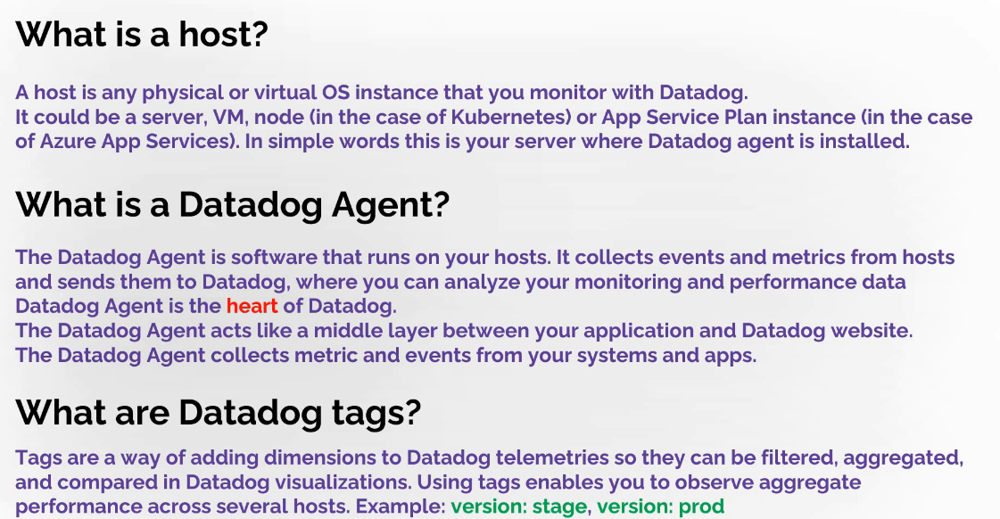
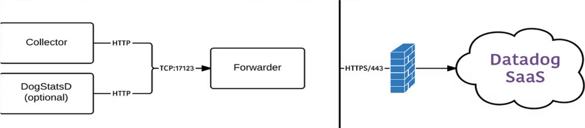

# Datadog

Aplication performance management

Datadog is an observability service for cloud-scale applications, providing monitoring of servers, databases, tools, and services, through a SaaS-based data analytics platform.

there are multiple ways of sending data to datadog:

1. from datadog agent
2. using datadog api
3. integration

The Datadog Agent is software that runs on your hosts. After installation it automatically starts to collects events and metrics from hosts and sends them to Datadog, where you can search, filter, aggregate and alert on information. The Datadog Agent acts like a middle layer between your application and Datadog website.

The main components are two:
1. Collector – which collects data from your host on every 15 seconds
2. Forwarder – which sends data to Datadog over https

The main configuration file is: C:\ProgramData\Datadog\datadog.yaml
Configuration files for Integrations are in: C:\ProgramData\Datadog\conf.d

