# Kurse1

# Das Verb SEIN

Konjugiere das unregelmäßige Verb „sein“

Ich bin …
Du bist …
Er/Sie/Es ist …
Wir sind …
Ihr seid …
Sie/sie sind …

____________________

# Das Präsens: Position des Verbs in einem Satz

Das Präsens – Position des Verbs in einem Satz

Er spielt Fußball.
Ich heiße Frau Heinemann.
Wir haben einen Sohn.
Die Wohnung ist in Berlin.
Der Schreibtisch ist im Büro.
Sie sitzen auf dem Sofa.

Das Prädikat (das Verb) steht in einem Satz immer an zweiter Stelle:

Ich spiele Fußball.
Sie heißt Frau Heinemann.
Wir sitzen auf dem Sofa.
Du hast einen Sohn.
Das Haus ist in Berlin.

# Das Präsens: Position des Verbs in einer Frage


Fragen mit Fragewörtern:

Wie heißen Sie?
Wo wohnst du?
Wann gehen wir nach Hause?

Fragen ohne Fragewörter:

Sprichst du Deutsch?
Wohnen Sie in Amerika?
Hat er einen Sohn?

Mit einem Fragewort steht das Personalpronomen (ich, du er, sie, es, wir, ihr, sie) nach dem Verb.

Wie machst du das?
Wann seid ihr da?
Wo wohnen sie?
Ohne Fragewort steht das Verb am Anfang der Frage.

Wohnst du … ?
Sprecht ihr … ?
Haben sie … ?

# Leute grüßen und Fragen stellen

Wie begrüßt man informell (Freunde, Bekannte)

Hallo
Hi
Grüß dich
Tag
Wie begrüßt man formell (Unbekannte, Ältere Leute)

Guten Morgen
Guten Tag
Guten Abend
Fragen stellen (informell)

Wie geht’s? (Singular)/Wie geht’s euch? (Plural)
Alles klar?
Fragen stellen (formell)

Wie geht es Ihnen?
Antworten und danke sagen

Es geht mir gut, danke.
Sehr gut, danke.
Ausgezeichnet, danke.
Alles in Ordnung.

# Sich vorstellen (formell und informell)

Wie Sie informell nach dem Namen fragen

Wie heiβt du?
Wer bist du?
Wie Sie formell nach dem Namen fragen

Wie heiβen Sie?
Wer sind Sie?
Wie Sie sich informell vorstellen

Ich bin …
Mein Name ist …
Ich heiβe …
Wie Sie sich formell vorstellen

Mein Name ist …
Ich heiβe …

# Grundlegende persönliche Informationen geben
Lernen Sie, die wichtigsten Dinge über sich selbst zu sagen.

Im Folgenden finden Sie grundlegende Informationen, die Sie bereitstellen können, wenn Sie sich vorstellen

Name und Alter

Mein Name ist Tina.
Ich bin 34 Jahre alt.
Adresse und Nationalität

Ich bin Französin.
Ich wohne in der Lindenstraße 19.
Telefonnummer

Meine Telefonnummer ist 0170 / 1234 567.

# Sich verabschieden
Lernen Sie wie man sich formell und informell verabschiedet.

Wie man sich informell verabschiedet:

Tschüss
Bis bald
Wir sehen uns
Bis dann
Tschau
Wie man sich formell verabschiedet:

Auf Wiedersehen

# Die Verben „kommen" und „wohnen"
Lernen Sie die Verben „kommen" und „wohnen" zu konjugieren.

Wir kommen aus einem Land.

ich komme …
du kommst …
er/sie/es kommt …
wir kommen …
ihr kommt …
Sie/sie kommen …
Wir wohnen in einer Stadt.

ich wohne …
du wohnst …
er/sie/es wohnt …
wir wohnen …
ihr wohnt …
Sie/sie wohnen …

# Bestimmte Artikel
Lernen Sie maskuline, feminine und neutrale bestimmte Artikel kennen.

Bestimmte Artikel sind der (maskulin), die (feminin/Plural) und das (neutral). Diese Artikel werden verwendet:

wenn wir von etwas Bestimmten sprechen
Beispiel:
Lena ist die Freundin von Franz. (die einzige – sie sind ein Paar)
 
wenn wir etwas als bekannt voraussetzen
Beispiel:
Das Eis schmeckt sehr gut.

# Unbestimmte Artikel
Lernen Sie maskuline, feminine und neutrale unbestimmte Artikel anzuwenden.

Unbestimmte Artikel sind ein(maskulin), eine(feminin/Plural) und ein (neutral). Diese Artikel werden verwendet:

wenn etwas nicht näher bestimmt ist.
Beispiel:
Lena ist eine Freundin von Lara. (eine von mehreren)
 
wenn wir etwas zum ersten Mal erwähnen.
Beispiel:
Lena hat ein Eis gekauft.


Ein Stift
Ein Schreibtisch
Ein Computer
Ein Block
Ein Radiergummi
Eine Lampe
Eine Maus
Eine Schere
Eine Tastatur
Eine Liste
Ein Handy
Ein Telefon
Ein Büro
Ein Internet
Ein Regal

# Die Farben


rot
orange
gelb
blau
grün
rosa
violett
braun
grau
schwarz
weiß

Das Sofa im Wohnzimmer ist rot.

Das Bild im Schlafzimmer ist gelb und violett.

Das Kissen im Bett ist weiß.

Der Teppich im Flur ist orange.

Das Radio in der Küche ist blau.

#  Menschen

Mit den folgenden Wörtern können Sie über Menschen sprechen:

Wörter, die sich auf Frauen beziehen

weiblich
die Frau
das Mädchen
Wörter, die sich auf Männer beziehen

männlich
der Mann
der Junge

Die Lehrerin ist weiblich.
Die Lehrerin ist eine Frau.
Die Schülerin ist ein Mädchen.
Der Lehrer ist männlich.
Der Lehrer ist ein Mann.
Der Schüler ist ein Junge.

Der CEO ist eine Frau. Ihr Name ist Bettina Weiß.
Der Koch ist ein Mann. Sein Name ist Arnold.

Der Schüler ist ein Junge. Sein Name ist Ralf.
Die Studentin ist ein Mädchen. Ihr Name ist Kati.

Der Arzt ist männlich. Er ist Dr. Emil Braun.
Die Lehrerin ist weiblich. Sie ist Frau Dr. Elena Möller.

# Die Berufe


Ein Architekt
Eine Architektin
Ein Arzt
Eine Ärztin
Ein Bäcker
Eine Bäckerin
Ein Buchhalter
Eine Buchhalterin
Ein Fotograf
Eine Fotografin
Ein Geschäftsmann
Eine Geschäftsfrau
Ein Informatiker
Eine Informatikerin
Ein Ingenieur
Eine Ingenieurin
Ein Journalist
Eine Journalistin
Ein Lehrer
Eine Lehrerin
Ein Pilot
Eine Pilotin
Ein Rechtsanwalt
Eine Rechtsanwältin

Ich bin Arzt.

Du bist Rechtsanwalt.

Er ist Journalist.

Sie ist Pilotin.

Wir sind Lehrer.

Ihr seid Informatiker.

Sie/sie sind Ingenieure.

Die feminine Form (f) folgt meistens der maskuline Form (m) mit der Endung -in (Singular) oder -innen (Plural)

Singular

Der Ingenieur/Die Ingenieurin
Ein Ingenieur/Eine Ingenieurin
Plural

Die Ingenieure/Die Ingenieurinnen
Es gibt auch einige feminine Berufsbezeichnungen, die ganz anders gebildet werden:

Der Geschäftsmann/Die Geschäftsfrau
Der Krankenpfleger/Die Krankenschwester

# Das Verb „sprechen"

Konjugiere das unregelmäßige Verb „sprechen“

Ich spreche …
Du sprichst …
Er/Sie/Es spricht …
Wir sprechen …
Ihr sprecht …
Sie/sie sprechen …

Ich spreche Deutsch.
Du sprichst Englisch.
Er spricht Französisch.
Sie spricht Italienisch.
Wir sprechen Japanisch.
Ihr sprecht Russisch.
Sie/sie sprechen Spanisch.

# Länder und Nationalitäten

Die feminine Form (f) folgt meistens der maskulinen Form (m) mit der Endung -in (Singular)

Maskulin

Der Spanier
Der Italiener
Der Belgier
Der Norweger
Der Schweizer
Feminin

Die Spanierin
Die Italienerin
Die Belgierin
Die Norwegerin
Die Schweizerin
Plural  

Die Spanier
Die Italiener
Die Belgier
Die Norweger
Die Schweizer
Land

Spanien
Italien
Belgien
Norwegen
Schweiz

Land

Deutschland
Nationalität (m/f)

Deutscher/Deutsche

Land

Frankreich


Nationalität (m/f)

Franzose/Französin

Land

England


Nationalität (m/f)

Engländer/Engländerin


Land

Spanien


Nationalität (m/f)

Spanier/Spanierin

Land

Italien


Nationalität (m/f)

Italiener/Italienerin

Land

Belgien


Nationalität (m/f)

Belgier/Belgierin


Land

Die Schweiz


Nationalität (m/f)

Schweizer/Schweizerin


Land

Dänemark


Nationalität (m/f)

Däne/Dänin


Land

Norwegen


Nationalität (m/f)

Norweger/Norwegerin

Land

Schweden


Nationalität (m/f)

Schwede/Schwedin

Land

Finnland


Nationalität (m/f)

Finne/Finnin

Land

Russland


Nationalität (m/f)

Russe/Russin

Land

Japan


Nationalität (m/f)

Japaner/Japanerin

Land

China


Nationalität (m/f)

Chinese/Chinesin


Land

Indien


Nationalität (m/f)

Inder/Inderin


Land

Amerika


Nationalität (m/f)

Amerikaner/Amerikanerin


Ich komme aus Amerika. Ich bin Amerikaner.
Du kommst aus Russland. Du bist Russin.
Er kommt aus Japan. Er ist Japaner.
Sie sind aus England. Sie sind Engländerinnen.

# Sprachen

Ich komme aus Deutschland und ich spreche Deutsch.
Du kommst aus Spanien und du sprichst Spanisch.
Er kommt aus Frankreich und er spricht Französisch.
Sie kommt aus Italien und sie spricht Italienisch.
Ich komme aus England und ich spreche Englisch.
Wir kommen aus Russland und wir sprechen Russisch.
Ihr kommt aus Japan und ihr sprecht Japanisch.
Sie kommen aus China und Sie sprechen Chinesisch.
Du kommst aus Norwegen und du sprichst Norwegisch.

Sprachen sind Substantive/Nomen und werden deshalb groß geschrieben.

Ich spreche Englisch.
Du sprichst Deutsch.
Er spricht Russisch.
Sie spricht Japanisch.
Wir sprechen Italienisch.
Ihr sprecht Französisch.
Sie/sie sprechen Spanisch.

# Das Indefinitpronomen „man"

Man bezeichnet allgemeine, unbestimmte Personen im Singular oder Plural. Das Verb ist immer im Singular. 

Beispiel: Bedeutung von man = Singular
Wenn man (jemand) krank ist, sollte man (er/sie) zum Arzt gehen.
 
Beispiel: Bedeutung von man = Plural
In Spanien spricht man (alle Leute) Spanish.


In Deutschland spricht man Deutsch.
Man spricht Deutsch in Deutschland

In Frankreich spricht man Französisch.
Man spricht Französisch in Frankreich.

In England, Amerika und Australien spricht man Englisch.
Man spricht Englisch in England, Amerika und Australian.

In Russland spricht man Russisch.
Man spricht Russisch in Russland.

In Japan spricht man Japanisch.
Man spricht Japanisch in Japan.

# Konjugation von „unterrichten" und „lernen"

Das Verb „unterrichten“

ich unterrichte
du unterrichtest
er unterrichtet
sie unterrichtet
wir unterrichten
ihr unterrichtet
Sie unterrichten
sie unterrichten


Das Verb „lernen“

ich lerne
du lernst
er lernt
sie lernt
wir lernen
ihr lernt
Sie lernen
sie lernen

# Personalpronomen im Akkusativ und die Verben „suchen" und „sehen"

Das Verb „sehen“

Ich sehe mich
Du siehst dich
Er sieht ihn
Sie sieht sie
Wir sehen uns
Ihr seht euch
Sie/sie sehen sie


Das Verb „suchen“

Ich suche mich
Du suchst dich
Er sucht ihn
Sie sucht sie
Wir suchen uns
Ihr sucht euch
Sie/sie suchen sie

Dies sind die Personalpronomen im Nominativ und Akkusativ:

- Nominativ

ich
du
er/sie/es
wir
ihr
Sie/sie

- Akkusativ

mich
dich
ihn, sie, es
uns
euch
Sie, sie

# Die Zahlen

1 eins
2 zwei
3 drei
4 vier
5 fünf
6 sechs
7 sieben
8 acht
9 neun
10 zehn
11 elf
12 zwölf
13 dreizehn
14 vierzehn
15 fünfzehn
16 sechzehn
17 siebzehn
18 achtzehn
19 neunzehn
20 zwanzig

20 zwanzig
21 einundzwanzig
22 zweiundzwanzig
 
30 dreißig
31 einunddreißig
32 zweiunddreißig
 
40 vierzig
41 einundvierzig
42 zweiundvierzig

50 fünfzig
51 einundfünfzig
52 zweiundfünfzig
 

60 sechzig
63 dreiundsechzig
68 achtundsechzig
70 siebzig
73 dreiundsiebzig
78 achtundsiebzig
80 achtzig
83 dreiundachtzig
88 achtundachtzig
89 neunundachtzig
90 neunzig
93 dreiundneunzig
100 (ein)hundert

200 zweihundert
202 zweihundertzwei
220 zweihundertzwanzig
 
300 dreihundert
303 dreihundertdrei
330 dreihundertdreißig
 
400 vierhundert
404 vierhundertvier
440 vierhundertvierzig
 
500 fünfhundert
505 fünfhundertfünf
550 fünfhundertfünfzig
 
600 sechshundert
606 sechshundertsechs
660 sechshundertsechzig
 
700 siebenhundert
707 siebenhundertsieben
770 siebenhundertsiebzig
 
800 achthundert
808 achthundertacht
880 achthunderachtzig
 
900 neunhundert
909 neunhundertneun
990 neunhundertneunzig
 
1000 (ein)tausend

# Die Uhrzeit

Es ist zwölf Uhr.

Es ist ein Uhr.

Es ist zwei Uhr.

Es ist drei Uhr.

Es ist vier Uhr.

Es ist fünf Uhr.

Es ist sechs Uhr.

Es ist sieben Uhr.

Es ist acht Uhr.

Es ist neun Uhr.

Es ist zehn Uhr.

Es ist elf Uhr.

Es ist halb zwölf.

Es ist halb eins.

Es ist halb zwei.

Es ist halb drei.

Es ist halb vier.

Es ist halb fünf.

Es ist halb sechs.

Es ist halb sieben.

Es ist halb acht.

Es ist halb neun.

Es ist halb zehn.

Es ist halb elf.

Es ist Viertel vor vier.

Es ist Viertel vor acht.

Es ist zehn vor sieben.

Es ist zwanzig vor neun.

Es ist Viertel nach zwei.

Es ist Viertel nach sechs.

Es ist zehn nach fünf.

Es ist zwanzig nach acht.

- Es ist elf Uhr.
- Es ist zwei Uhr.
- Es ist halb sieben.
- Es ist halb neun.
- Es ist Viertel vor zehn.
- Es ist zwanzig vor acht.
- Es ist Viertel nach elf.
- Es ist zehn nach vier.

# Familienmitglieder

Mein Vater heiβt Manfred.

Meine Tochter heiβt Annika.

Mein Sohn heiβt Joachim.

Meine Frau heiβt Kerstin.

Mein Mann heiβt Lukas.

Das Possessivpronomen bekommt eine Endung. Die Endung richtet sich nach dem Geschlecht des Nomens.

- Meine Mutter (f)
- Mein Vater (m)
- Mein Bruder (m)
- Meine Schwester (f)
- Mein Großvater (Opa) (m)
- Meine Großmutter (Oma) (f)
- Meine Frau (f)
- Mein Mann (m)
- Mein Sohn (m)
- Meine Tochter (f)

Im Plural (Mehrzahl) ist die Form immer gleich.

- Meine Töchter (f) heißen Andrea und Sandra.
- Meine Söhne (m) heißen Markus und Rene.

# Der Akkusativ

## Der 4. Fall

Der Bruder

Ich habe den Bruder.

Ein Bruder

Ich habe einen Bruder.
Der/ein Bruder wohnt in Hamburg.
Ich habe den/einen Bruder.

Die Lampe

Ich habe die Lampe.

Eine Lampe

Ich habe eine Lampe.
Die/eine Lampe ist auf dem Tisch.
Sie hat die/eine Lampe.

Das Telefon

Ich habe das Telefon.

Ein Telefon

Ich habe ein Telefon.
Das/ein Telefon ist im Wohnzimmer.
Du hast das/ein Telefon.

Der Akkusativ können Sie mit der Frage „Wen oder was …?“ bestimmen.

Die Schwester
Ich habe eine Schwester.
Frage: Wen hast du? - Antwort: Eine Schwester.
 
Der Stift
Ich habe den Stift.
Frage: Was hast du? - Antwort: Einen Stift.

# Das Verb „haben"

- Ich habe einen Bruder.
- Du hast eine Tochter.
- Er hat eine Frau.
- Sie hat einen Mann.
- Wir haben eine Großmutter
- Ihr habt einen Großvater.
- Sie/sie haben einen Sohn.

Konjugation des unregelmäßigen Verbs „haben“

Ich habe …
Du hast …
Er/Sie/Es hat …
Wir haben …
Ihr habt …
sie/Sie haben …

# Es gibt

Es gibt viele Touristen in Berlin.

Es gibt viele Menschen in München.

Es gibt viele Deutsche in Deutschland.

Es gibt viele Städte in Amerika.

Gibt es viele Touristen in Berlin?

Gibt es viele Menschen in München?

Gibt es viele Deutsche in Deutschland?

Gibt es viele Städte in Amerika?

Es gibt + Akkusativ drückt aus, dass etwas vorhanden ist oder präsentiert wird.

Es gibt …!
Gibt es …?
Hay + Acusativo expresa que algo está presente o se presenta.

Hay …!
Hay …?

# Präpositionen

Ich wohne in Berlin.

Du kommst aus Deutschland.

Er fliegt von England nach Frankreich.

Der Mann sitzt zwischen zwei Frauen.

Die Frau sitzt auf dem Sofa.

Die Katze ist unter dem Stuhl.

Der Mann sitzt vor dem Sofa.

Sie stehen hinter dem Schreibtisch.

Wo …?

… in der Bahn.
… aus Spanien.
… von Berlin.
… nach Hause.
… zwischen dem Haus und dem Garten.
… auf der Mauer.
… unter dem Tisch.
… vor dem Stuhl.
… hinter dem Schrank.

# Hobbys und Interessen

Ich interessiere mich für Sport.

Du interessierst dich für Musik.

Er interessiert sich für Filme.

Sie interessiert sich für Tiere.

Wir interessieren uns für Reisen.

Ihr interessiert euch für Sprachen.

Sie/sie interessieren sich für Mode.

Um Hobbys und Interessen zu äußern, benutzt man das reflexive Verb „sich interessieren“ mit der Präposition „für“.

Ich interessiere mich für Tiere.
Er interessiert sich für Sprachen.
Wir interessieren uns für Mode.
Sie/sie interessieren sich für Sport.

# Personalpronomen im Akkusativ und die Verben „suchen" und „sehen"

Das Verb „sehen“

Ich sehe mich
Du siehst dich
Er sieht ihn
Sie sieht sie
Wir sehen uns
Ihr seht euch
Sie/sie sehen sie

Das Verb „suchen“

Ich suche mich
Du suchst dich
Er sucht ihn
Sie sucht sie
Wir suchen uns
Ihr sucht euch
Sie/sie suchen sie

Dies sind die Personalpronomen im Nominativ und Akkusativ:

**Nominativ**

ich
du
er/sie/es
wir
ihr
Sie/sie

**Akkusativ**

mich
dich
ihn, sie, es
uns
euch
Sie, sie

# Personalpronomen im Dativ

Personalpronomen im Dativ und das Verb „helfen“

Ich helfe mir
Du hilfst dir
Er hilft ihm
Sie hilft ihr
Wir helfen uns
Ihr helft euch
Sie/sie helfen ihnen

Die Personalpronomen werden auch persönliche Fürwörter genannt.

Dies sind die Personalpronomen im Nominativ und Dativ

**Nominativ*

ich
du
er/sie/es
wir
ihr
Sie/sie

**Dativ*

mir
dir
ihm, ihr, ihm
uns
euch
ihnen

# Nebenordnende Konjunktionen (und, oder, aber)

- Wir spielen gern Fußball und Federball.
- Ihr sprecht Deutsch und Englisch.
- Du hast einen Sohn und eine Tochter.

Du gehst nach Deutschland oder Frankreich.
Sie sprechen Italienisch oder Spanisch.
Wir arbeiten im Büro oder zu Hause.

ch interessiere mich für Fußball, aber ich spiele nicht.
Er wohnt in Stuttgart, aber er spricht kein Deutsch.
Wir arbeiten am Computer, aber wir haben kein Internet.

Konjunktionen verbinden Wörter, Wortgruppen oder Teilsätze.

Du gehst weg und ich bleibe hier.
Sie sind nach Hamburg oder (nach) Bremen gefahren.
Wir wollen Äpfel, aber keine Birnen kaufen.

# Die Negative „nicht" und „kein"

Nicht steht vor dem Adjektiv. 

Ich finde Deutsch nicht einfach.
Er findet seinen Bruder nicht nett.
Wir finden Spanisch nicht interessant.

Kein steht vor dem Substantiv. 

Sie hört keine Musik.
Du bist kein Architekt.
Ihr seid keine Franzosen.

Die Negation eines Nomens mit bestimmtem Artikel lautet „nicht“.

Ich spiele nicht gerne.
La negación de un sustantivo con artículo definido es "no".

No me gusta jugar.
Die Negation eines Nomens mit unbestimmtem Artikel lautet „kein“.

Das ist kein Auto.
kein (maskulin, neutral)
keine (feminin, Plural)
La negación de un sustantivo con artículo indefinido es “no”.

Eso no es un auto.
ninguno (masculino, neutral)
ninguno (femenino, plural)

La diferencia clave entre "nicht" y "kein" es que "nicht" se usa para negar el verbo o el sustantivo, mientras que "kein" se utiliza para negar la existencia o cantidad de algo. Además, "kein" debe concordar en género y número con el sustantivo al que se refiere.

# Possessivpronomen im Nominativ

Das ist mein Vater.
Das ist meine Mutter.
Das sind meine Eltern.
Das ist dein Bruder.
Das ist deine Schwester.
Das sind deine Geschwister.
Das ist ihr Großvater.
Das ist ihre Großmutter.
Das sind ihre Großeltern.
Das ist sein Freund.
Das ist seine Freundin.
Das sind seine Freunde.
Das ist unser Vater.
Das ist unsere Mutter.
Das sind unsere Eltern.
Das ist euer Großvater.
Das ist eure Großmutter.
Das sind eure Großeltern
Das ist ihre Tochter.
Das ist ihr Sohn.
Das sind ihre Kinder.

Das Possessivpronomen drückt einen Besitz oder eine Zugehörigkeit aus.

Singular Maskulin/Neutrum

ich - mein
du - dein
er - sein
sie - ihr
es - sein
Singular Feminim

ich - meine
du - deine
er - seine
sie - ihre
es - seine
Plural Maskulin/Neutrum

wir - unser
ihr - euer
sie/Sie - ihr/Ihr
Plural Feminim

wir - unsere
ihr - eure
sie/Sie - ihre/Ihre

# Reflexive Verben

Infinitiv = sich duschen

ich dusche mich
du duschst dich
er duscht sich
sie duscht sich
wir duschen uns
ihr duscht euch
Sie/sie duschen sich


Infinitiv = sich kämmen

ich kämme mich
du kämmst dich
er kämmt sich
sie kämmt sich
wir kämmen uns
ihr kämmt euch
Sie/sie kämmen sich


Infinitiv = sich rasieren

ich rasiere mich
du rasierst dich
er rasiert sich
sie rasiert sich
wir rasieren uns
ihr rasiert euch
Sie/sie rasieren sich

# Fragen stellen und beantworten (formell)

**Fragen stellen**

Wie ist Ihr Name?
Wie geht es Ihnen?
Sprechen Sie Englisch?
Wohnen Sie in Deutschland?
Interessieren Sie sich für Sprachen?

**Fragen beantworten**

Mein Name ist …
Sehr gut, danke. 
Ja, ich spreche Deutsch und Englisch.
Nein, mein Mann und ich wohnen in London.

## Fragen stellen und beantworten (informell)

**Fragen stellen**

Wie heißt du?
Wo wohnst du?
Hast du Hobbys?
Sprichst du Deutsch?
Interessierst du dich für Sprachen?
Und du?

**Fragen beantworten**

Ich heiße …
Ich wohne in einer Wohnung in Berlin.
Ich spreche Deutsch.
Ich interessiere mich für Filme und Tiere.

# Fragen, was jemand von Beruf macht

**Formell**

Was machen Sie beruflich?
Was arbeiten Sie?

**Informell**

Was machst du beruflich? 
Was arbeitest du?

# Nach der Uhrzeit fragen und darauf antworten

**Nach der Uhrzeit fragen**

Wissen Sie, wie spät es ist?
Können Sie mir bitte sagen, wie spät es ist?
Entschuldigung, wie viel Uhr ist es?

**Antworten geben**

Ja sicher, es ist halb vier.
Sicher, es ist zehn vor acht.
Es ist Viertel vor zehn.

# Kurse 2

## Gebäude (1)

Was suchst du?

Ich suche ein Museum.
Ich suche ein Restaurant.
Ich suche einen Bahnhof.
Ich suche eine Bank.

Was siehst du am Alexanderplatz?

Am Alexanderplatz sehe ich eine Post.
Am Alexanderplatz sehe ich eine Kirche.
Am Alexanderplatz sehe ich ein Café.
Am Alexanderplatz sehe ich ein Geschäft.

Was gibt es hier?

Es gibt hier eine Schule.
Es gibt hier ein Krankenhaus.
Es gibt hier ein Theater.
Es gibt hier ein Kino.

Die Post
Ich suche eine Post
 
Das Theater
Ich suche ein Theater
 
Das Krankenhaus
Am Alexanderplatz sehe ich ein Krankenhaus
 
Die Schule
Am Alexanderplatz sehe ich eine Schule
 
Der Bahnhof
Es gibt hier einen Bahnhof
 
Die Kirche
Es gibt hier eine Kirche

## Häuser und Wohnungen

Es gibt hier ein Hochhaus.

Ich suche eine Wohnung.

Er sieht ein Penthouse.

Sie finden den Bauernhof schön.

Wir sehen ein Bungalow.

Das Einfamilienhaus ist groß.

In München gibt es eine Villa.

Bestimmter/Unbestimmter Artikel + Eigenheim

Der/Ein Bungalow
Der/Ein Bauernhof
Die/Eine Wohnung
Die/Eine Villa
Das/Ein Haus/Einfamilienhaus
Das/Ein Hochhaus
Das/Ein Penthouse

## Läden und Geschäfte

Wohin gehst du heute?

Ich gehe heute in die Bäckerei.

Ich gehe heute in die Metzgerei.

Ich gehe heute in die Konditorei.

Was sucht er?

Er sucht einen Supermarkt.

Er sucht eine Boutique.

Er sucht ein Blumengeschäft.

Was ist das?

Das ist ein Kiosk.

Das ist ein Markt.

Das ist eine Apotheke.

Ich gehe heute in das Blumengeschäft.
Ich gehe heute in ein Blumengeschäft.
 
Er sucht die Metzgerei.
Er sucht eine Metzgerei.
 
Das ist die Konditorei.
Das ist eine Konditorei.

## Gebäude (2)

Wohin gehen Sie?

Ich gehe ins Reisebüro.

Ich gehe in die Bibliothek.

Ich gehe ins Fitnessstudio.

Ich gehe ins Hotel.

Was sucht ihr?

Wir suchen einen Park.

Wir suchen eine Kneipe.

Wir suchen die Polizeidienststelle.

Wir suchen den Flughafen.

Gibt es hier ein Schwimmbad?

Ja, es gibt hier ein Schwimmbad.

Gibt es hier eine Tankstelle?

Nein, es gibt hier leider keine Tankstelle.

Gibt es hier einen Friseursalon?

Ja, es gibt hier einen Friseursalon.

Gibt es hier ein Tourist-Informationszentrum?

Nein, es gibt hier leider kein Tourist-Informationszentrum.

Das Hotel
Der Flughafen
Das Schwimmbad
Die Bibliothek
Die Tankstelle
Die Polizeidienststelle
Das Reisebüro
Der Friseursalon
Der Park
Das Tourist-Informationszentrum
Die Kneipe
Das Fitnessstudio

## Essen und Trinken

Was kaufen Sie heute?

Heute kaufe ich Reis.

Heute kaufe ich einen Kuchen.

Heute kaufe ich Obst.

Heute kaufe ich Gemüse.

Heute kaufe ich einen/ein Joghurt.

Gehen Sie in die Bäckerei?

Ja, ich brauche Brot.

Ja, ich brauche Brötchen.

Gehen Sie in die Apotheke?

Nein, ich gehe in die Metzgerei. Ich brauche Fleisch, Schinken und Würstchen.

Was trinkst du?

Ich trinke Wasser.

Ich trinke Tee mit Milch.

Ich trinke Kaffee.

Ich trinke Bier.

Was sucht sie?

Sie sucht Mehl und Öl.

Sie sucht Schokolade.

Sie sucht Eis und Käse.

Allgemeine Lebensmittel

Das Brot
Das Brötchen
Der Käse
Der Kuchen
Das Fleisch
Das Öl
Das Wasser
Der Tee
Der Kaffee
Das Bier
Die Milch
Der/Das Joghurt
Das Obst
Das Gemüse
Die Schokolade
Der Schinken
Das Eis
Der Reis
Das Mehl
Die Wurst
Das Würstchen

## Fragewörter

Wo wohnen Sie?
Ich wohne in Bremen.

Wo wohnen Sie?
Ich wohne in Bremen.

Wer ist das?
Das ist Frau Kellner.

Welche Sprachen sprechen Sie?
Ich spreche Englisch und Deutsch.

Wie viele Kinder haben Sie?
Ich habe drei Kinder: Einen Sohn und zwei Töchter.

Warum haben wir kein Internet im Büro?
Wir haben im Moment keinen Strom.

Wann gehen wir nach Hause?
Um sieben Uhr gehen wir nach Hause.

Was ist das?
Das ist ein Stift.

W-Fragen

Wo wohnst du?
Wie heißt du?
Wer bist du?
Welche Sprachen sprichst du?
Wie viele Schwestern hast du?
Warum lachst du?
Wann gehst du ins Kino?
Was machst du?
Preguntas W

¿Dónde vive?
¿Cómo te llamas?
¿Quién eres?
¿Qué idiomas hablas?
¿Cuantas hermanas tienes?
¿Por qué te ríes?
¿Cuándo vas al cine?
¿Qué estás haciendo?

## Die Präpositionen „bei" und „in"

Die Präpositionen „bei” und „in”  geben eine Antwort auf die Frage „wo?”

„Bei” benutzt man zur Ortsangabe bei: Angaben in der Nähe von, einem Aufenthalt bei Personen, Arbeitsplätzen.

Die kleine Stadt Garching liegt bei München.

Bei mir zu Hause ist es schön.

Ich bin bei Eva zu Hause.

Ich stehe beim Kopierer.

„In” benutzt man für regelmäßige oder längere Aufenthalte in einem Gebäude, Ortsangaben, Regionen, Landschaften, Gebirge, Länder, Bewegung in einen geschlossenen Raum hinein, Straßennamen.

Ich bin in der Schule (im Büro, in der Bücherei, im Café, in der Disko, in einer Fabrik, im Geschäft, im Kino, in der Kirche, im Krankenhaus, im Museum, im Restaurant, im Theater, in der Uni, in der Vorlesung, im Zoo, …).

Ich bin in der Türkei (in Deutschland, im Iran, im Libanon, in den Niederlanden, in der Schweiz, in den USA, …).

Ich arbeite im Ausland (in den Alpen, in den Bergen, im Gebirge, in der Stadt, …).

Ich bleibe im Haus (im Bad, im Bett, im Garten, im Hotel, im Keller, im Park, im Zimmer, im Zelt, …).

Ich wohne in der Merowingerstraße.

Die Präpositionen „bei” und „in”  geben eine Antwort auf die Frage „wo?”

„Bei” benutzt man zur Ortsangabe bei: Angaben in der Nähe von,  einem Aufenthalt bei Personen, Arbeitsplätzen.

„In” benutzt man für regelmäßige oder längere Aufenthalte in einem Gebäude, Ortsangaben, Regionen, Landschaften, Gebirge, Länder, Bewegung in einen geschlossenen Raum hinein, Straßennamen.

## Maß- und Mengenangaben


Die Flasche
Der Becher
Die Dose
Die Kiste
Die Tafel (Schokolade)
Die Packung
Der Sack
Das Pfund
Das Dutzend (Eier)
Das Kilo(gramm)
Das Paar (Schuhe)
Das Stück (Kuchen)
Die Tüte
Das Glas

Ich trinke drei Gläser Wasser.

Du trinkst einen Becher Milch.

Wir nehmen eine Flasche Öl.

Sie nehmen vier Cola-Dosen.

Es gibt eine Kiste Wein hier.

Es gibt eine Tafel Schokolade dort.

Ihr kauft eine Packung Tee.

Er kauft ein Pfund Butter.

Mengenangaben mit unbestimmten Artikel:

Ich esse ein Stück Kuchen.
Du trinkst eine Flasche Wasser.

Wir kaufen ein Dutzend Eier.
Sie kaufen eine Packung Milch.

Es gibt ein Kilo Wurst hier.
Es gibt ein Sack Reis dort.

Ihr kauft eine Kiste Bier.
Er kauft eine Tüte Chips.

## Im Laden nach etwas/nach dem Preis fragen

Wo finde ich …?
Wo finde ich Mehl und Reis?
Haben Sie … bitte?
Haben Sie frisches Gemüse bitte?
Ich suche …
Ich suche Fleisch.
Ich brauche …
Ich brauche Schinken und Fleisch.
Wo haben Sie … bitte?
Wo haben Sie Kuchen und Schokolade bitte?
Wie viel kostet/kosten …?
Wie viel kosten Wiener Würstchen?
Ich nehme … Kilo/Packungen/Flaschen.
Ich nehme drei Flaschen Milch.

Dónde puedo encontrar …?
¿Dónde puedo encontrar harina y arroz?
¿Tienes... por favor?
¿Tiene alguna verdura fresca, por favor?
Estoy buscando …
Estoy buscando carne.
Necesito …
Necesito jamón y carne.
¿Dónde... por favor?
¿Dónde está el pastel y el chocolate, por favor?
Cuánto cuesta…?
¿Cuánto cuestan las salchichas vienesas?
Tomo... kilos/paquetes/botellas.
Tomo tres botellas de leche.

## Pluralformen von Substantiven

Pluralendungen

-(e)n:

Singular

der Architekt
die Frau
der Name
Plural

die Architekten
die Frauen
die Namen
Pluralendungen

-e:

Singular

der Tisch
der Fisch
das Brot
Plural

die Tische
die Fische
die Brote

Pluralendungen

-e (mit Umlaut)

Singular

der Arzt
die Wurst
der Bahnhof
Plural

die Ärzte
die Würste
die Bahnhöfe
Pluralendungen

-er:

Singular

das Kind
das Ei
das Feld
Plural

die Kinder
die Eier
die Felder

Pluralendungen

-er (mit Umlaut):

Singular

das Haus
das Land
der Mann
Plural

die Häuser
die Länder
die Männer
Pluralendungen

-s:

Singular

das Kino
das Café
das Restaurant
Plural

die Kinos
die Cafés
die Restaurants

Pluralendungen

- (keine Endung):

Singular

das Mädchen
der Lehrer
der Bäcker
Plural

die Mädchen
die Lehrer
die Bäcker
Pluralendungen

-+ (Umlaut):

Singular

der Apfel

Plural

die Äpfel

Bei der Pluralbildung gibt es keine allgemeingültige Regel.

No existe una regla general a la hora de formar plurales.
Die meisten Nomen bilden ihre Pluralform mit „en“(m), „er“ (m) oder „e“ (f). Einige bilden einen Umlaut ( ä/ö/ü ).

La mayoría de los sustantivos forman su forma plural con “en” (m), “er” (m) o “e” (f). Algunos forman una diéresis (ä/ö/ü).
Neutrale Nomen, die auf –er, –en, –el , –chen und –lein enden haben keine Pluralendung.

Los sustantivos neutros que terminan en –er, –en, –el, –chen y –lein no tienen terminación plural.
Die meisten Nomen, die auf –a, –i oder –o enden, bilden den Plural mit einem „s“.

La mayoría de los sustantivos que terminan en –a, –i o –o forman el plural con una “s”.

## Trennbare Verben 1

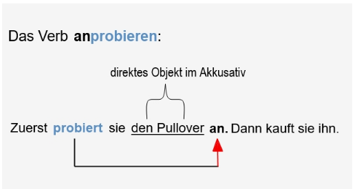

Ich probiere den Pullover an.
Du probierst den Pullover an.
Er/Sie/Es probiert den Pullover an.

Wir probieren den Pullover an.
Ihr probiert den Pullover an.
Sie probieren den Pullover an.


Das Verb anziehen:

Zuerst zieht er das Hemd an. Dann geht er zur Arbeit. 

Ich ziehe das Hemd an.
Du ziehst das Hemd an.
Er/Sie/Es zieht das Hemd an.

Wir ziehen das Hemd an.
Ihr zieht das Hemd an.
Sie ziehen das Hemd an.

Das Verb ausziehen:

Wir kommen nach Hause und wir ziehen die Jacke aus.      

Ich ziehe die Jacke aus.
Du ziehst die Jacke aus.
Er/Sie/Es zieht die Jacke aus.

Wir ziehendie Jacke aus.
Ihr zieht die Jacke aus.
Sie ziehen die Jacke aus.

Verbzusätze geben dem Verb eine völlig neue Bedeutung.

an | probieren
Ich probiere den Pullover an.
 
an | ziehen
Ich ziehe den Pullover an.
 
aus | ziehen
Ich ziehe den Pullover aus.
Las adiciones verbales le dan al verbo un significado completamente nuevo.

a | probar
Me pruebo el suéter.
a | jalar
Me puse el suéter.
de | jalar
Me quito el suéter.

## Trennbare Verben 2

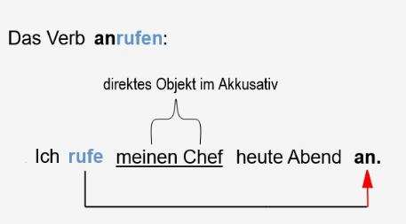

Ich rufe die Kollegin an.
Du rufst die Kollegin an.
Er/Sie/Es ruft die Kollegin an.

Wir rufen die Kollegin an.
Ihr ruft die Kollegin an.
Sie rufen die Kollegin an.

Das Verb aufmachen:

Ich mache das Fenster auf.
Du machst das Fenster auf.
Er/Sie/Es macht das Fenster auf.

Wir machen das Fenster auf.
Ihr macht das Fenster auf.
Sie machen das Fenster auf.

Das Verb zumachen:

Ich mache das Fenster zu.
Du machst das Fenster zu.
Er/Sie/Es macht das Fenster zu.

Wir machen das Fenster zu.
Ihr macht das Fenster zu.
Sie machen das Fenster zu.

Verbzusätze geben dem Verb eine völlig neue Bedeutung.

an | rufen
Ich rufe die Kollegin an.
 
auf | machen
Ich mache das Fenster auf.
 
zu | machen
Ich mache das Fenster zu.

## Konjugation von Verben „anhaben" und „tragen"

Das trennbare Verb anhaben

Sie hat heute einen Pullover an = Sie trägt heute einen Pullover.

Ich habe einen Pullover an.
Du hast einen Pullover an.
Er/Sie/Es hat einen Pullover an.

Wir haben einen Pullover an.
Ihr habt einen Pullover an.
Sie haben einen Pullover an.

Das Verb tragen

Er trägt Hemden und Jeans sehr gern.

Ich trage ein Hemd.
Du trägst ein Hemd.
Er/Sie/Es trägt ein Hemd.

Wir tragen ein Hemd.
Ihr tragt das Hemd.
Sie tragen das Hemd.

an | haben

Ich habe … an
Du hast … an
Er/Sie/Es hat … an
Wir haben … an
Ihr habt … an
Sie haben … an
tragen

Ich trage …
Du trägst …
Er/Sie/Es trägt …
Wir tragen …
Ihr tragt …
Sie tragen …

## Kleidung

Das T-Shirt
Die T-Shirts

Der Anzug
Die Anzüge

Der Mantel
Die Mäntel

Die Mütze
Die Mützen

Die Hose
Die Hosen

Die Krawatte
Die Krawatten

Der Pullover
Die Pullover

Die Jacke
Die Jacken

Der Schal
Die Schals

Das Kleid
Die Kleider

Die Bluse
Die Blusen

Der Rock
Die Röcke

Was tragen Sie gern?

Ich trage gern T-Shirts.

Ich trage gern Kleider.

Ich trage gern Pullover.

Ich trage gern Anzüge.

Was hat sie heute an?

Sie hat einen Mantel an.

Sie hat einen Rock an.

Sie hat eine Bluse an.

Sie hat eine Jacke an.

Was ist das?

Das ist eine Hose.

Das ist ein Schal.

Das ist eine Mütze.

Das ist eine Krawatte.

## Kleidung (2)

Die Badehose
Die Badehosen

Der Bikini
Die Bikinis

Der Gürtel
Die Gürtel

Die Socke
Die Socken

Der Schuh
Die Schuhe

Die Jeans

Der Handschuh
Die Handschuhe

Die Shorts

Der Hut
Die Hüte

Das Hemd
Die Hemden

Das Unterhemd
Die Unterhemden

Der Stiefel
Die Stiefel

Was sucht ihr?

Wir suchen einen Hut.

Wir suchen Handschuhe.

Wir suchen einen Gürtel.

Wir suchen ein Hemd.

Was brauchst du?

Ich brauche Schuhe.

Ich brauche Stiefel.

Ich brauche ein Unterhemd.

Ich brauche Socken.

Was kaufst du heute?

Heute kaufe ich eine Jeans.

Heute kaufe ich ein Paar Shorts.

Heute kaufe ich eine Badehose.

Heute kaufe ich einen Bikini.


## Modalverb KÖNNEN

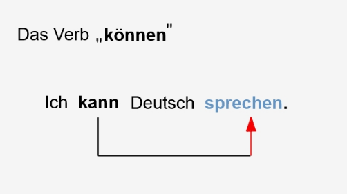

Ich kann Deutsch sprechen
Du kannst das Fenster aufmachen.
Er/Sie/Es kann gut singen.
Wir können dir helfen.
Ihr könnt kein Englisch sprechen.
Sie können nach Hause gehen.

Fragen

Kann ich Ihnen helfen?
Kannst du Fußball spielen?
Kann er Spanisch sprechen?

Können wir den Pullover anprobieren?
Könnt ihr die Tür zumachen?
Können sie/Sie lesen und schreiben?

„Können“ ist ein Modalverb und verändert in Kombination mit einem zweiten Verb den Sinn des Satzes. 

Ich kann Englisch sprechen.
Du kannst nach Hause gehen.
Wir können Fußball spielen.
 
Kann ich heute nach Hause kommen?
Kannst du die Tür aufmachen?
Können wir Pizza essen?

## Kleidung kaufen und über Kleidung sprechen


Kann ich Ihnen helfen?
Ich suche …
Ich suche eine Hose.
Welche Größe brauchen Sie?
Wie finden Sie den/die/das hier?
Wie finden Sie den Anzug hier?
Wie finden Sie die Jacke hier?
Wie finden Sie das Kleid hier?
Den/die/das finde ich …
Den finde ich sehr schön/sehr gut.
Die finde ich zu groß/zu klein/zu eng.
Kann ich … anprobieren?
Kann ich das T-Shirt anprobieren?
Kann ich die Stiefel anprobieren?
Passt …?
Passt die Hose?
… ist mir leider zu …
Die Hose ist mir leider zu groß.
Haben Sie die Jacke in Klein/Medium/Groß?
Haben Sie den Mantel auch in Rot/Schwarz/Braun?

## Der Dativ

Subjekt +  Verb +  indirektes Objekt im Dativ +  direktes Objekt im Akkusativ

Er kauft ein Buch.
Er kauft mir ein Buch.
Er kauft dem Bruder (m.) ein Buch.
Er kauft der Schwester (f.) ein Buch.
Er kauft dem Kind (nt.) ein Buch.
Er kauft den Freunden (Pl.)  ein Buch.

MASKULINUM: Der Mann

Nominativ: Das ist ein/der Mann.
Akkusativ: Ich sehe einen/den Mann.
Dativ: Ich helfe einem/dem Mann.

FEMININUM: Die Frau

Nominativ: Das ist eine/die Frau.
Akkusativ: Ich sehe eine/die Frau.
Dativ: Ich helfe einer/der Frau.

PLURAL: Die Freunde

Nominativ: Das sind die Freunde.
Akkusativ: Ich sehe die Freunde.
Dativ: Ich helfe den Freunden.

NEUTRUM: Das Kind

Nominativ: Das ist ein/das Kind.
Akkusativ: Ich sehe ein/das Kind.
Dativ: Ich helfe einem/dem Kind.

## Präpositionen- Akkusativ und Dativ

### Akkusativ

FÜR para

Das Buch ist für dich.

DURCH a mtraves de

Wir gehen durch den Park.

OHNE sin

Ich trinke Kaffee ohne Milch.

### Dativ

MIT con

Ich spreche mit dem Mann.

AUS fuera de

Sie kommen aus der Schweiz.

VON de

Wir sprechen von dir.

NACH despues

Nach dem Konzert gehen wir nach Hause.

BEI en

Er wohnt bei den Eltern.

ZU a

Ich gehe zur (zu der) Arbeit.

### Akkusativ und Dativ

IN, VOR, HINTER
(AUF, AN, NEBEN, UNTER, ÜBER, ZWISCHEN)
WOHIN? = Akkusativ

DENTRO, DELANTE, DETRÁS
(EN, EN, AL LADO, DEBAJO, SOBRE, ENTRE)
¿DÓNDE? = acusativo

Wohin gehen Sie?
Ich gehe in DEN Supermarkt.
Ich gehe in DIE Schule.
Ich gehe in DAS Geschäft.

WO? = Dativ

Wo sind Sie?
Ich bin in DEM Supermarkt.
Ich bin in DER Schule.
Ich bin in DEM Geschäft.

Ich fahre das Auto vor DAS Haus.
= WOHIN? = Akkusativ

Das Auto steht vor DEM Haus.
= WO? = Dativ

ch fahre das Auto hinter DAS Haus.
= WOHIN? = Akkusativ

Das Auto steht hinter DEM Mann
= WO? = Dativ

## Reisen


Die Reise buchen/reservieren (Verb)

Sie bucht eine Reise nach Österreich.

Die Weltreise
Die Weltreisen

Er macht eine Weltreise.

Das Reisebüro
Die Reisebüros

Wir gehen ins Reisebüro und reservieren eine Reise nach Amerika.

Das Ausland

Wir fahren sehr gern ins Ausland.

Der Urlaub
Die Urlaube

Sie haben viel Spaß am Strand. Sie sind im Urlaub.

Der Campingplatz
Die Campingplätze

Wo ist hier der Campingplatz?

Der Reisepass
Die Reisepässe

Man braucht den Reisepass im Ausland.

Der Koffer
Die Koffer

Das ist mein Koffer.

packen (Verb)

Ich gehe in den Urlaub. Ich packe den Koffer.

Das Gepäck

Das ist mein Gepäck.

Was ist das?

Das ist mein Reisepass.
Das ist das Gepäck.
Das ist der Campingplatz.

Wohin fahren Sie?

Ich fahre in den Urlaub.

Was macht ihr?

Wir buchen eine Reise ins Ausland.
Wir gehen ins Reisebüro.
Wir reservieren eine Weltreise.
Wir packen den Koffer.


## Touristenattraktionen

Das Schloss
Die Schlösser

Die Burg
Die Burgen

Die Kathedrale
Die Kathedralen

Die Galerie
Die Galerien

Der Strand
Die Strände

Das Meer = Die See
Die Meere = Die Seen

Das Museum
Die Museen

Der See
Die Seen

Die Kirche
Die Kirchen

Der Zoo
Die Zoos

besichtigen (Verb)
Die Besichtigung

Das Einkaufszentrum
Die Einkaufszentren

Die Berge

Das Rathaus
Die Rathäuser

Wohin fahren Sie?

Ich fahre in die Berge.

Ich fahre ans Meer.

Wo steht …?

Wo steht das Haus? Das Haus steht am See.

Wo steht die Burg? Die Burg steht in der Nähe von der Kirche.

Was mögen Sie besichtigen?

Wir mögen die Kathedralen besichtigen.

Wie mögen die Schlösser besichtigen.

Wir mögen die Galerien besichtigen.

Was machen Sie gern im Urlaub?

Ich liege gern am Strand.

Ich gehe gern ins Einkaufszentrum.

Ich gehe gern in den Zoo.

Wo finde ich …?

Wo finde ich das Rathaus?

Wo finde ich das BMW Museum?

## Eine Eintrittskarte kaufen

Ich möchte gerne … Karten für …
Ich möchte gerne 4 Karten für Romeo und Julia.
Hier sind … Euro.
Hier sind 40 Euro.
Was kosten … Karten bitte?
Was kosten 3 Karten bitte?
Wie viel kostet die Jahreskarte?
Haben Sie spezielle Karten für Touristen?
Ich nehme …
Ich nehme 2 Tageskarten.
Ich möchte gerne wissen …
Ich möchte gerne wissen, wo der Souvenirladen ist.
Gibt es spezielle Eintrittspreise für Gruppen?

## Transportmittel

Das Auto/Der Wagen
Die Autos/Die Wagen

Das Taxi
Die Taxis

Der Bus
Die Busse

Das Fahrrad
Die Fahrräder

Der Zug
Die Züge

Die U-Bahn
Die U-Bahnen

Das Flugzeug
Die Flugzeuge

Der LKW
Die LKWs

Das Motorrad
Die Motorräder

Das Schiff
Die Schiffe

Die Straßenbahn
Die Straßenbahnen

Zu Fuß

Der Bahnhof
Die Bahnhöfe

Die Bushaltestelle
Die Bushaltestellen

einsteigen (Verb)

aussteigen (Verb)

Wie kommt er zur Arbeit?

Er kommt mit dem Auto/Wagen.
Er kommt mit dem Zug.
Er kommt mit dem Bus.
Er kommt zu Fuß.

Wie kommt ihr zur Party?

Wir kommen mit dem Taxi.
Wir kommen mit der U-Bahn.
Wir kommen mit der Straßenbahn.

Wie fahren Sie in Urlaub?

Ich fahre mit dem Schiff.
Ich fliege mit dem Flugzeug.

Wo nehmen Sie … ?

Wo nehmen Sie den Zug? Am Bahnhof.
Wo nehmen Sie den Bus? An der Bushaltestelle.

Kannst du … fahren?

Kannst du Motorrad fahren?
Kannst du (Fahr)Rad fahren?
Kannst du LKW fahren?

Wo steigt man in den Bus ein?

Man steigt an der Bushaltestelle ein.

Wo steigt man aus dem Bus aus?

Man steigt an der Bushaltestelle aus.

## Auf der Straße

Die Kreuzung
Die Kreuzungen

Die Ampel
Die Ampeln

Das Verkehrszeichen
Die Verkehrszeichen

Der Kreisel
Der Kreisverkehr/Die Kreisel

Der Zebrastreifen
Die Zebrastreifen


überqueren (Verb)

Die Fußgängerzone
Die Fußgängerzonen

stoppen (Verb)

Der Fahrradweg

parken (Verb)

Der Parkplatz
Die Parkplätze

Die Ampel zeigt Rot.

Das Auto stoppt an der Kreuzung. Sie können die Straße überqueren.

Benutzen Sie den Zebrastreifen.

Benutzen Sie den Fahrradweg.

Er parkt den Wagen hinter dem Haus.

Ich kenne alle Verkehrszeichen.

Sie stoppt am Kreisverkehr.

Es gibt viele Menschen in der Fußgängerzone.

Es gibt einen Parkplatz vor dem Supermarkt.

## „Woher?" und „wohin?"

- Das Fragewort „woher?” fragt Menschen, woher sie kommen - entweder in diesem Moment oder generell.

„Woher kommen Sie gerade?”
„Ich komme gerade vom Supermarkt.”

„Woher kommen Sie?”
„Ich komme aus Spanien.”

Auch kann das Fragewort „woher?” getrennt werden. In diesem Fall steht die Präposition am Satzende.

„Wo kommst du denn her?”
„Ich komme gerade vom Supermarkt.”

„Wo kommst du her?”
„Ich komme aus Spanien.”

Die Bedeutung ist bei beiden Varianten identisch.

- Das Fragewort „wohin?” fragt Menschen, wohin sie wollen. Normalerweise wird es mit den Verben möchten, wollen, gehen oder fahren verwendet.

„Wohin möchten Sie?”
„Ich möchte zum Supermarkt.”

„Wohin gehst du?”
„Ich gehe in den Park.”

Auch „wohin?” kann, genau wie „woher?”, getrennt werden. Die Bedeutung ändert sich nicht.

„Wo willst du hin?”
„Ich will zur Bibliothek.”

„Wo fahren Sie hin?”
„Ich fahre zum Büro.”

- Das Fragewort „woher?” fragt Menschen, woher sie kommen - entweder in diesem Moment oder generell.

Woher kommen Sie gerade?

Auch kann das Fragewort „woher?” getrennt werden. In diesem Fall steht die Präposition am Satzende. Die Bedeutung ist bei beiden Varianten identisch.

Wo kommst du denn her?

Das Fragewort „wohin?” fragt Menschen, wohin sie wollen. Normalerweise wird es mit den Verben möchten, wollen, gehen oder fahren verwendet.

Wohin möchten Sie?

Auch „wohin?” kann, genau wie „woher?”, getrennt werden. Die Bedeutung ändert sich nicht. 

Wo willst du hin?

## Präpositionen - Wo sind die Objekte?

vor + Dativ

Der Mann steht vor dem Haus.
Das Geschäft ist vor der Schule.

hinter + Dativ

Die Frau steht hinter dem Baum.
Das Restaurant ist hinter der Metzgerei.

neben + Dativ

Der Mann sitzt neben der Frau.
Die Post ist neben dem Kino.

zwischen + Dativ

Die Bücher sind zwischen den Lampen.
Die Bäckerei ist zwischen dem Café und dem Friseursalon.

gegenüber + Dativ

Die Geschäfte auf der linken Seite sind gegenüber den Geschäften auf der rechten Seite.
Der Park ist gegenüber der Polizeidienststelle.

in der Nähe von + Dativ
nahe/nicht weit von + Dativ

Die Häuser sind in der Nähe vom Park.
Das Schwimmbad ist in der Nähe von der Schule.

in der Friedrichstraße

Die Firma ist in der Friedrichstraße.

Die Frage Wo …?

vor …
hinter …
neben …
zwischen …
gegenüber …
in der Nähe von …
in der …

## Wegbeschreibung

geradeaus

Ich gehe geradeaus.

Die Straße entlang gehen

Sie geht die Schulstraße entlang.

an … vorbei

Die Männer gehen am Café vorbei.

nach rechts

Wir gehen nach rechts.

nach links

Ihr geht nach links.

abbiegen

Das Auto biegt links ab.

auf der linken Seite

Das Auto ist auf der linken Straßenseite.

auf der rechten Seite

Der Radfahrer ist auf der rechten Straßenseite.

Ich gehe geradeaus.

Du gehst die Manfredstraße entlang.

Er geht nach rechts/links.

Wir gehen an der Schule vorbei.

Klaus biegt rechts ab.

Das Auto biegt links ab.

Ulrike sieht die Kirche auf der linken Seite.

Markus sieht das Museum auf der rechten Seite.

## Wegbeschreibung 2

die Ecke

Das ist die Ecke zweier Straßen.

um die Ecke gehen

Sie geht um die Ecke.

an der Ecke

Es gibt eine Kneipe an der Ecke.

bis zur Kreuzung/an der Kreuzung

Sie gehen bis zur Kreuzung. Sie warten an der Kreuzung.

bis zur Ampel/an der Ampel

Sie fahren bis zur Ampel. Sie warten an der Ampel.

über die Brücke

Sie fahren über die Brücke.

über den Platz

Die Menschen gehen über den Altstadtplatz.

in Richtung … gehen/fahren

Wir fahren in Richtung Potsdam.

bis zum Kreisel/Kreisverkehr

Sie fahren bis zum Kreisel.

Sie geht um die Ecke.
Ihr geht über den Platz.
Sie gehen bis zur Ampel.
 
Elke wartet an der Ecke.
Silke wartet an der Ampel.
Hartmut wartet an der Kreuzung.

Du fährst bis zur Kreuzung.
Ich fahre über die Brücke.
Er fährt in Richtung Regensburg.
Sie fährt bis zum Kreisverkehr.

## Nach dem Weg fragen

Entschuldigung, können Sie mir helfen?
Ich suche …
Ich suche einen Friseursalon in der Nähe.
Gibt es … in der Nähe?
Gibt es einen Supermarkt in der Nähe?
Wo ist hier …?
Wo ist hier der Bebelplatz bitte?
Ich bin auf der Suche nach …
Ich bin auf der Suche nach einem Fitnessstudio.
Wie komme ich zum/zur …?
Entschuldigung, wie komme ich zum Hotel?
Wie kommen wir zur Bibliothek bitte?
Wo finde ich …?
Entschuldigen Sie, wo finde ich die Polizeidienststelle?

¿Disculpe, me podría ayudar?
Estoy buscando …
Estoy buscando una peluquería cerca.
¿Hay...cerca?
¿Hay algún supermercado cerca?
Donde es aquí …?
¿Dónde está Bebelplatz aquí, por favor?
Busco …
Estoy buscando un gimnasio.
Cómo llego a...?
Disculpe, ¿cómo llego al hotel?
¿Cómo llegamos a la biblioteca, por favor?
Dónde puedo encontrar …?
Disculpe, ¿dónde puedo encontrar la comisaría?

## Wegbeschreibungen verstehen und geben

Das ist (nicht) weit weg von hier.
Gehen Sie geradeaus.
Gehen Sie nach rechts/links.
Biegen Sie rechts/links ab.
Gehen Sie die Straße entlang.
Gehen Sie bis zum/zur …
Gehen Sie bis zum Bismarckplatz.
Gehen Sie an … vorbei.
Gehen Sie an der Post vorbei.
Gehen Sie über …
Gehen Sie über die Brücke/Straße/Platz.
Nehmen Sie die … Straße rechts/links.
Nehmen Sie die dritte Straße links.
Überqueren Sie die Straße. = Gehen Sie über die Straße.

Esto (no) está muy lejos de aquí.
Adelante.
Ir a la derecha/izquierda.
Gire a la derecha/izquierda.
Baja por la calle.
Ve a la...
Camine hasta Bismarckplatz.
Pasar por el frente...
Pase por delante de la oficina de correos.
Superalo…
Camine por el puente/calle/plaza.
Tome la calle... derecha/izquierda.
Tome la tercera a la izquierda.
Cruza la calle. = Cruzar la calle.

## Orte in der Stadt: Geschäfte und Ämter


die Bank

Wir bezahlen unsere Rechnungen bei einer Bank.

die Klinik

Wir suchen einen Arzt in einer Klinik auf.

der Supermarkt / das Lebensmittelgeschäft

Wir kaufen Lebensmittel und Getränke in einem Supermarkt / Lebensmittelgeschäft.

die Bäckerei

Brot kaufen wir in der Bäckerei.

die Apotheke
Wir kaufen Medikamente in einer Apotheke.

die Tankstelle

Wir kaufen Benzin an einer Tankstell

der Waschsalon

Wir waschen unsere Wäsche in einem Waschsalon.

## Orte in der Stadt: Öffentlicher Dienst


die Schule

Ein Lehrer arbeitet in einer Schule.

das Krankenhaus

Eine Krankenschwester arbeitet in einem Krankenhaus.

die Post

Ein Postbote arbeitet bei der Post.
Wir geben Briefe bei der Post ab.

der Flughafen

Wir nehmen einen Flug am Flughafen.


die Bushaltestelle / der Busbahnhof

Wir nehmen einen Bus am Busbahnhof.

der Bahnhof

Wir nehmen einen Zug am Bahnhof.

die Polizeiwache

Ein Polizist arbeitet in einer Polizeiwache.

die Feuerwehr

Ein Feuerwehrmann arbeitet bei der Feuerwehr.

das Rathaus

Wir heiraten im Rathaus.

## Über Orte sprechen

Jan ist in der Küche.


Er ist im Konferenzraum.


Sie sind im Speisesaal.

Martha ist im Park.


Sie ist bei der Bank.


Sie sind im Restaurant.


Markus geht ins Büro.


Sie geht nach Kanada.


Lina und Peter fahren zum Flughafen.

Wir verwenden das Verb sein und Ortspräpositionen, um zu sagen, wo wir sind:

Ich bin in der Küche.
Er ist bei der Bank.

Wir verwenden Verben der Bewegung und Ortspräpositionen, um zu sagen, wohin wir gehen:

Sie fahren zum Flughafen.
Wir gehen zum Supermarkt.

## Am Flughafen

fliegen (Verb)

Die Flugnummer

abfliegen (Verb)
Der Abflug

Die Abflughalle


Die Fluggesellschaft

Der/Das Terminal


Der Informationsschalter

Die Infotafel

Der Check-in Schalter

Das Gepäck

Die Bordkarte

Das Boarding

Das Gate

starten = beginnen (Verben)

Wir fliegen oft nach München.

Er fliegt um 18 Uhr von Terminal 3 ab.

Wir warten in der Abflughalle und suchen unsere Flugnummer auf der Infotafel.

Unsere Fluggesellschaft hat ihre Check-in Schalter vorne rechts.

Frau Richter arbeitet am Informationsschalter.

Sie haben nicht viel Gepäck.

Mit der Bordkarte geht man zum Gate.

Das Boarding beginnt um 20 Uhr.

## Orientierung am Flughafen 1

Wie komme ich zum Terminal …? Wo ist Terminal …? Wo finde ich Terminal …? Ich suche Terminal …
Wie komme ich zum Terminal 2 bitte? Wo ist hier Terminal 3? Wo finde ich Terminal 1A? Ich suche Terminal 1B.Von welchem Terminal fliege ich ab?
Wo sind die Infotafeln?
Wo finde ich den richtigen Check-in Schalter?
Wann öffnet mein Check-in Schalter?

## Orientierung am Flughafen 2

Wie viele Gepäckstücke haben Sie?
Ich habe ein Stück Handgepäck.
Von welchem Gate fliege ich ab?
Gehen Sie zum Gate …
Gehen Sie zum Gate C38.
Wann beginnt das Boarding?
Wann geht man zum Boarding?

¿Cuántas maletas tienes?
Tengo una pieza de equipaje de mano.
¿Por qué puerta salgo?
Ve a la puerta...
Vaya a la puerta C38.
¿Cuándo comienza el embarque?
¿Cuándo vas a embarcar?

## Am Bahnhof

Die Fahrkarte
Die Fahrkarten

einfach (einfache Fahrt)

Der Fahrplan
Die Fahrpläne

Das Gleis
Die Gleise

Die Gleisnummer
Die Gleisnummern

Der Bahnsteig
Die Bahnsteige

ankommen (Verb)
Die Ankunft

abfahren (Verb)
Die Abfahrt

Der Schalter
Die Schalter

Der Fahrkartenautomat
Die Fahrkartenautomaten

Der Wagen/Waggon
Die Wagen/Waggons

Der Schaffner
Die Schaffner

Wie kann ich Ihnen helfen?

Wir brauchen 2 Fahrkarten hin und zurück.

Eine einfache Fahrkarte, bitte!

Wo finde ich den Fahrplan?

Wo steht die Gleisnummer?

Von welchem Gleis fährt der Zug ab?

Der Zug fährt von Gleis 2 ab.

Wann kommt der Zug an?

Der Zug kommt in 20 Minuten an.

Wo kauft man die Fahrkarten?

Man kauft die Fahrkarten am Schalter.

Man kauft die Fahrkarten an den Fahrkartenautomaten.

Wo wartet man auf den Zug?

Man wartet an dem Bahnsteig.

Wie viele Wagen hat der Zug?

Der Zug hat 20 Wagen.

Was ist Herr Wagner von Beruf?

Er ist Schaffner von Beruf.

## Orientierung am Bahnhof

Eine Fahrkarte erster/zweiter Klasse nach …, bitte.
Erste oder zweite Klasse?
Einfach oder hin und zurück?|
Was/Wie viel kostet die Fahrkarte?
Was kostet die Fahrkarte hin und zurück?
Wie viel kostet die einfache Fahrt?
Wann fährt der Zug ab?
Wann kommt der Zug an?
Der Zug kommt um … Uhr an.
Der Zug kommt um 18 Uhr 45 in Berlin an.
Von welchem Gleis fährt der Zug ab?

Un billete de primera/segunda clase para..., por favor.
¿Primera o segunda clase?
¿Ida o ida y vuelta?|
¿Cuánto/cuánto cuesta el billete?
¿Cuánto cuesta el billete de ida y vuelta?
¿Cuánto cuesta el billete de ida?
¿A qué hora sale el tren?
¿Cuándo llegará el tren?
El tren llega a las... en punto.
El tren llega a Berlín a las 18:45.
¿De qué andén sale?

# Kurse 3

## Das Konditional - möchten

MÖCHTEN = einen Wunsch haben 
                   = Konjunktiv II von MÖGEN

Ich möchte (nicht) ins Kino gehen.
Du möchtest (nicht) ins Kino gehen.
Er/Sie/Es möchte (nicht) ins Kino gehen.

Wir möchten (nicht) ins Kino gehen.
Ihr möchtet (nicht) ins Kino gehen.
Sie/sie möchten (nicht) ins Kino gehen.

Ich möchte einen Kaffee. = Ich möchte einen Kaffee trinken.
Du möchtest ein Stück Kuchen. = Du möchtest ein Stück Kuchen essen.
Er möchte ein neues Auto. = Er möchte ein neues Auto haben.

Fragen

Möchten Sie ein Buch lesen?
Was möchtest du machen?
Wohin möchtet ihr gehen?

Das Modalverb möchten/mögen hat zwei Hauptbedeutungen, nämlich den Wunsch haben, etwas zu tun oder an etwas oder jemandem Gefallen finden. 

Ich möchte
Du möchtest
Er/Sie/Es möchte
Wir möchten
Ihr möchtet
Sie/sie möchten
El verbo modal querer/gustar tiene dos significados principales: tener el deseo de hacer algo o que le guste algo o alguien.

Me gustaría
Tú quieres
él/ella quiere
Nos gustaría
Quieres
tu/ellos quieren

## Ordinalzahlen

der, die, das erste
der, die, das, zweite
der, die, das dritte
der, die, das vierte
der, die, das fünfte
der, die, das sechste
der, die, das siebte
der, die, das achte
der, die, das neunte
der, die, das zehnte
der, die, das elfte
der, die, das zwölfte
der, die, das dreizehnte
der, die, das vierzehnte
der, die, das fünfzehnte
der, die, das sechzehnte
der, die, das siebzehnte
der, die, das achtzehnte
der, die, das neunzehnte
der, die, das zwanzigste
der, die, das einundzwanzigste
der, die, das zweiundzwanzigste
der, die, das dreißigste
der, die, das einunddreißigste
der, die, das vierzigste
der, die, das fünfzigste
der, die, das sechzigste
der, die, das siebzigste
der, die, das achtzigste
der, die, das (ein)hundertste
der, die, das (ein)tausendste
der, die, das zehntausendste
der, die, das (ein)hunderttausendste
der, die, das (ein)millionste
Eine Million
der, die, das (ein)milliardste
Eine Milliarde
der, die, das (ein)billionste
Eine Billion


der, die, das neunzigste

Ordinalzahl 1 – 19 = bestimmter Artikel + Kardinalzahl + -te
Ordinalzahl ab 20 = bestimmter Artikel + Kardinalzahl + -ste

Beispiel:

Kardinalzahl: 4 = vier
Ordinalzahl (<20): 4. = der (die, das) vierte
Ordinalzahl (>19): 24. = der (die, das) vierundzwanzigste

Bei den Ordinalzahlen 1 bis 19 treten wenige Unregelmäßigkeiten auf. Alle anderen Ordinalzahlen werden regelmäßig gebildet.

Unregelmäßigkeiten:

Kardinalzahl – Ordinalzahl
eins – erste
drei – dritte
sieben – siebte
acht – achte (ein –t)

## Wochentage

Die Woche
Die Wochen

Eine Woche hat 7 Tage.

Der Montag
Die Montage

Montag ist der erste Wochentag.

Der Dienstag
Die Dienstage

Dienstag ist der zweite Wochentag.

Der Mittwoch
Die Mittwoche

Mittwoch ist der dritte Wochentag.

Der Donnerstag
Die Donnerstage

Donnerstag ist der vierte Wochentag.


Der Freitag
Die Freitage

Freitag ist der fünfte Wochentag.

Der Samstag
Die Samstage

Samstag ist der sechste Wochentag.

Der Sonntag
Die Sonntage

Sonntag ist der siebte Wochentag.

Der Arbeitstag
Die Arbeitstage

Man arbeitet an den Arbeitstagen.

Das Wochenende
Die Wochenenden

Am Wochenende (Samstag und Sonntag) arbeitet man normalerweise nicht.

Die Woche beginnt am Montag.

Nach dem Montag kommt der Dienstag.

Nach dem Dienstag kommt der Mittwoch.

Nach dem Mittwoch kommt der Donnerstag.

Nach dem Donnerstag kommt der Freitag.

Am Arbeitstag arbeitet man.

Am Samstag und Sonntag ist Wochenende.

Eine Woche hat 7 Tage:

Montag
Dienstag
Mittwoch
Donnerstag
Freitag
Samstag
Sonntag
Am Wochenende arbeiten die meisten Leute nicht. Es wird nur an Arbeitstagen gearbeitet.

## Monate und Jahreszeiten

Das Jahr
Die Jahre

Der Monat
Die Monate


Der Januar
Der Februar
Der März
Der April
Der Mai
Der Juni
Der Juli
Der August
Der September
Der Oktober
Der November
Der Dezember

Die Jahreszeit
Die Jahreszeiten


Der Frühling
Der Sommer
Der Herbst
Der Winter

Das Jahr hat 12 Monate und 4 Jahreszeiten.

Der Dezember, Januar und Februar sind Wintermonate.

Der März, April und Mai sind Frühlingsmonate.

Der Juni, Juli und August sind Sommermonate.

Der September, Oktober und November sind Herbstmonate.

## Das Datum

Das Datum
Die Daten

Das heutige Datum ist der 1. Januar.

heute (hoy)

Heute ist der erste Januar.
Heute ist der erste Erste.

gestern (ayer)

Gestern war der einunddreißigste Dezember.
Gestern war der einunddreißigste Zwölfte.

vorgestern (antiayer)

Vorgestern war der dreißigste Dezember.
Vorgestern war der dreißigste Zwölfte.

morgen (mañana)

Morgen ist der zweite Januar.
Morgen ist der zweite Erste.

übermorgen (pasado mañana)

Übermorgen ist der dritte Januar.
Übermorgen ist der dritte Erste.

Das Jahr
Die Jahre

neunzehnhundertsiebzig

Im Jahre neunzehnhundertsiebzig(1970) war ich in Amerika.


neunzehnhundertdreiundachtzig (1983)


zweitausendzwölf(2012)

Das heutige Datum ist …

… ist der + Ordinalzahl + Monat

Heute ist der elfte Zehnte.

Morgen ist der zwölfte Zehnte.

Übermorgen ist der dreizehnte Oktober.

Gestern war der zehnte Oktober.

Vorgestern war der zehnte Oktober.

Im Jahre …

1652: sechzehnhundertzweiundfünfzig

1894: achtzehnhundertvierundneunzig

1950: neunzehnhundertfünfzig

2017: zweitausendsiebzehn

## Über das Datum sprechen

Frau Werner: Entschuldigen Sie bitte, der Wievielte ist heute?
Herr Hamman: Heute ist der zehnte August.

Frau Werner: Entschuldigen Sie bitte, den Wievielten haben wir heute?
Herr Hamman: Heute haben wir den zehnten August.

Herr Hamman: Entschuldigung, welchen Tag haben wir heute?
Frau Werner: Heute haben wir Montag, den siebten April.

Frau Werner: Wann haben Sie Geburtstag, Herr Hamman?
Herr Hamman: Ich habe am achtzehnten Dezember Geburtstag.

Herr Hamman: Wie lange waren Sie in Österreich, Frau Werner?
Frau Werner: In Österreich war ich vom dreißigsten Dezember bis zum siebten Januar.

Welches Datum haben wir heute?
Der Wievielte ist heute? = Den Wievielten haben wir heute?
Welcher Tag ist heute? = Welchen Tag haben wir heute?
 
Heute ist der + Ordinalzahl + Monat + Jahr
Heute ist der neunte März/Dritte 2017/zweitausendsiebzehn.
 
Heute haben wir den + Ordinalzahl-en + Monat + Jahr
Heute haben wir den neunten März/Dritten 2017/zweitausendsiebzehn.
 
am + Ordinalzahl-en + Monat
Wann hast du Geburtstag?
Ich habe am neunten Mai (Fünften) Geburtstag.
Der Termin ist am Freitag, dem neunten Mai (Fünften).
 
vom + Ordinalzahl + Monat + bis zum + Ordinalzahl + Monat
Wann habt ihr keinen Deutschkurs?
Vom siebenundzwanzigsten Juni bis zum dritten Juli haben wir keinen Deutschkurs.
 
von + Jahr + bis +Jahr
2012 - 2018: von zweitausendzwölf bis zweitausendachtzehn


## Wechselpräpositionen

AKKUSATIV
Wohin?

IN

Ich gehe in den Zoo.

DATIV
Wo?

IN

Ich bin im Zoo.

AKKUSATIV
Wohin?

VOR

Ich fahre das Auto vor das Haus.

DATIV
Wo?

VOR

Das Auto steht vor dem Haus.

AKKUSATIV
Wohin?

HINTER

Ich fahre das Auto hinter das Haus.


DATIV
Wo?

HINTER

Das Auto ist hinter dem Haus.

AKKUSATIV
Wohin?

AUF

Ulrike stellt die Vase auf den Tisch.

DATIV
Wo?

AUF

Die Vase steht auf dem Tisch.

AKKUSATIV
Wohin?

AN

Er hängt das Bild an die Wand.

DATIV
Wo?

AN

Das Bild hängt an der Wand. 

AKKUSATIV
Wohin?

NEBEN

Er stellt die Milch neben die Flasche Saft.

DATIV
Wo?

NEBEN

Der Kaffee ist neben dem Kuchen.

AKKUSATIV
Wohin?

UNTER

Sie stellt sich unter die Dusche.

DATIV
Wo?

UNTER

Der Hund ist unter dem Tisch.

AKKUSATIV
Wohin?

ÜBER

Sie zieht den Pullover über das T-shirt.

DATIV
Wo?

ÜBER

Die Lampen hängen über dem Tisch.

AKKUSATIV
Wohin?

ZWISCHEN

Er stellt den Wagen zwischen die Autos.

DATIV
Wo?

ZWISCHEN

Der Tisch steht zwischen den Sesseln.

Akkusativ
Wohin?

IN: in den... 
VOR: vor das …
HINTER: hinter das …
AUF: auf den …
AN: an die
NEBEN: neben die …
UNTER: unter die …
ÜBER: über das …
ZWISCHEN: zwischen die …
Dativ:
Wo?

IN: im
VOR: vor dem …
HINTER: hinter dem …
AUF: auf dem …
AN: an der
NEBEN: neben dem …
UNTER: unter dem …
ÜBER: über dem …
ZWISCHEN: zwischen den …

## Adverbien der Zeit

Immer = 100 %

Wir sprechen immer Deutsch im Deutschunterricht.

Nie = 0%

Wir sprechen nie Englisch im Deutschunterricht.

Meistens = 80%

Meistens trinke ich Kaffee ohne Zucker.

Oft = 60%

Wir gehen oft ins Kino.

Selten = 20%

Ich spiele nur selten Fußball.

Manchmal = 40%

Manchmal spiele ich Schach mit meinem Bruder.

Früh

Ich komme früh nach Hause.

Spät

Er kommt spät nach Hause.

Täglich = pro Tag

Ich esse dreimal täglich.

Wöchentlich = pro Woche

Er kauft zweimal wöchentlich ein.

Monatlich = pro Monat

Sie reist einmal monatlich nach Deutschland.

Jährlich = pro Jahr

Wir treffen uns zweimal jährlich.

Er bleibt immer zu Hause.

Meistens trinke ich Wasser.

Manchmal fahre ich mit der Straßenbahn.

Ich lese oft Bücher.

Sie geht nie ins Theater.

Wir sprechen selten Englisch.

Er geht früh in die Arbeit.

Sie kommen immer spät.

Sie waschen sich zweimal täglich.

Du rufst ihn zweimal wöchentlich an.

Sie besucht sie zweimal monatlich.

Ihr reist zweimal jährlich nach Frankreich.


____________________

# conjugador verbos

https://conjugador.reverso.net/conjugacion-aleman-verbo-malen.html

# Los tiempos verbales en alemán

Los tiempos verbales es algo que se nos suele mezclar en la cabeza. En el post de hoy queremos ordenar los tiempos verbales en alemán y que dejen de ser un lío para ti.

Los tiempos verbales en alemán
Los tiempos verbales se utilizan para situar en el tiempo una acción o un estado.

En el idioma alemán existen seis tiempos verbales en indicativo (Indikativ), el tiempo verbal indicativo indica acciones concretas. Estos seis tiempos verbales son:

- Präsens (Presente) Tiempo simple.
- Präteritum (Pretérito) Tiempo simple.
- Perfekt (Pasado perfecto) Tiempo compuesto.
- Plusquamperfekt (Pluscuamperfecto) Tiempo compuesto.
- Futur I (Futuro I) Tiempo compuesto.
- Futur II (Futuro II) Tiempo compuesto.

Dependiendo de si se utiliza un verbo auxiliar o no o su construcción sintáctica en la formación del tiempo verbales, tenemos en alemán:

- Tiempos verbales simples: son aquellos de estructura o construcción simple, es decir, que no necesitan verbos auxiliares o modales para expresar la acción. Por ejemplo: “Ich esse.” (Yo como.)
- Tiempos verbales compuestos: son los que se forman con la ayuda de un verbo auxiliar o verbos modales. Por ejemplo, “Ich habe gegessen.” (Yo he comido.)

- El modo verbal corresponde a las diferentes modalidades en que se expresan los tiempos verbales. Se conocen el modo indicativo (Indikativ), que indica acciones concretas; el modo conjuntivo (Konjunktiv II), que indica posibilidades o deseos y el imperativo (Imperativ), que representa órdenes o instrucciones.

- También hemos de destacar que en alemán el tiempo verbal gerundio no existe. 

##  Gerundio

El gerundio en alemán no existe en alemán en el sentido estricto de la palabra. Pero… ¿Cómo digo en Alemán: “Estoy comiendo”? Vamos a explicarlo en este post.

- ¿Qué es el gerundio?
Es una forma impersonal del verbo que no varía (como el infinitivo o el participio). Nos indica que una acción está en desarrollo, por ejemplo: Estoy cantando mientras cocino, cantando sería el gerundio.

- Se construye añadiendo al verbo los siguientes sufijos en español:

    - ando (soñando, caminando, pescando…)
    - iendo (sonriendo, riendo, comiendo…)
    - yendo (creyendo, oyendo…)

En inglés se forma con el famoso “-ing”. Por ejemplo: “I am singing.” (Yo estoy cantando.)

- ¿Cómo expresamos en alemán que una acción está en desarrollo?

En alemán no existe el tiempo verbal gerundio como en español e inglés. Se puede formar usando:

- Beim (bei + dem + verbo sustantivado)

Por ejemplos: “Sie war beim Laufen.” (Ella estaba corriendo.) Añadimos “beim” (bei + dem) para expresar un gerundio, es decir para expresar la acción en proceso. Sustantivar un verbo es convertirlo en sustantivo, por ejemplo: “Correr es saludable”, en este caso “correr” actúa como sujeto y sustantivo no como verbo. En alemán al sustantivar el verbo “laufen” tenemos que escribirlo en mayúscula (Laufen), porque ahora es un sustantivo. Como nota importante, todos los verbos sustantivados son del género neutro. Otro ejemplo: “Ich bin beim Essen.” (Yo estoy comiendo.)

- Gerade

Añade a la oración connotación de ahora mismo, de que la acción sucede en ese momento.

Por ejemplo: “Ich höre gerade Musik.” (Estoy escuchando música). En este momento estás realizando esa acción. Otro ejemplo: “Mein Bruder ist gerade beschäftigt.“ (Mi hermano está ocupado). Mi hermano está ocupado ahora mismo, en este instante.

Estas son algunas de las formas de expresar un tiempo verbal “gerundio” en Alemán, existen otras formas coloquiales y más informales, pero estas son las más correctas. 

_____________________________

## Präsens (Presente)
En este tiempo verbal la acción se sitúa en el momento en que se expresa o en un futuro inmediato. También se utiliza para describir acciones que se repiten o rutinas. Por ejemplo:

- “Ich frühstücke um 8:00 Uhr.” (Yo desayuno a las 8.)
- “Ich komme um 11.00 Uhr an.” (Yo llego a las 11:00 horas.)

## Perfekt (El pasado perfecto)
El pasado perfecto (Perfekt) es el tiempo verbal más utilizado en alemán para hablar de acciones y sucesos que ocurrieron en el pasado.

El pasado perfecto se forma utilizando un verbo auxiliar “haben” (haber/tener) o “sein” (ser/estar) conjugado en presente con el sujeto, y un participio (Partizip II). La estructura para su formación es la siguiente:

```Sujeto + verbo auxiliar “haben” o “sein” + complementos + participio (Partizip II)```

Por ejemplo:

- “Ich habe ein Bier getrunken.” (Me he bebido una cerveza.)
- “Ich bin zum Supermarkt gegangen.” (He ido al supermercado.)


### El pasado perfecto o "Perfekt" en alemán

Una de las mayores pesadillas, a parte de declinar, cuando se empieza a estudiar alemán, es el pasado perfecto (Perfekt). Hoy vamos a aprender todo sobre él.
- El pasado perfecto (Perfekt) es el tiempo verbal más utilizado en alemán para hablar de acciones y sucesos que ocurrieron en el pasado.

- El pasado perfecto se forma utilizando un verbo auxiliar “haben” (haber/tener) o “sein” (ser/estar) conjugado en presente con el sujeto, y un participio (Partizip II). La estructura para su formación es la siguiente:

```Sujeto + verbo auxiliar “haben” o “sein” + complementos + participio (Partizip II)```

Analicemos esta frase en pasado perfecto:

- Ich habe ein Bild gemalt. (Yo he pintado un cuadro /Yo pinté un cuadro.)

Observamos que usamos el verbo auxiliar “haben” conjugado con el sujeto (ich). El participio del verbo va siempre al final de la frase (en este caso el participio del verbo “malen” (pintar))

#### La formación del participio (Partizip)
Para ello no recomiendo ninguna regla, ya que muchos verbos no las siguen. Y lo que hace seguir reglas es llevar a la confusión. Recomiendo siempre consultar el conjugador reverso❗. Os los dejo por aquí:

https://conjugador.reverso.net/conjugacion-aleman.html

Como podéis ver podemos consultar el verbo auxiliar que utiliza el verbo para formar su pasado perfecto y el participio. Por ejemplo vamos a ver el verbo “essen”:

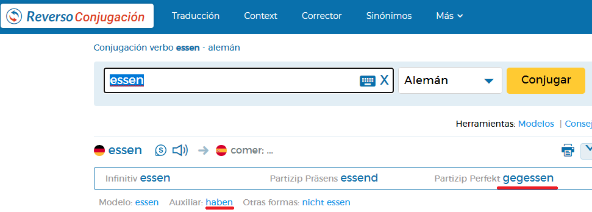

Cómo vemos señalado, si buscamos un verbo aparece su verbo auxiliar y el participio. Y esta es la mejor forma de aprender los participios y mejor olvidarse de reglas que pueden llevar a la confusión.

- Una regla que sí podemos utilizar es con los verbos que acaban en “-ieren”, como: “telefonieren“, “funktionieren“ o “trainieren“. Estos verbos eliminan la terminación “-en” del verbo y añaden un “-t” para formar su participio. Por ejemplo: trainieren–trainiert.

#### Cuándo usar “haben” o “sein” como verbo auxiliar

En la mayoría de casos se usa el verbo “haben” como auxiliar para la formación del pasado perfecto.

Como normal general, utilizamos en verbo auxiliar “sein” cuando el verbo indica algún tipo de desplazamiento o cambio de estado, aunque hay excepciones

Los principales verbos que usan “sein” como auxiliar son:

- fahren (ir, conducir, verbo irregular), por ejemplo: “Gestern bin ich nach Barcelona gefahren.” (Ayer he ido a Barcelona.)
- gehen (ir, verbo regular), por ejemplo: “Letzten Sonntag bin ich ins Kino gegangen.” (El pasado domingo he ido al cine.)
- fliegen (volar, ir, verbo regular), por ejemplo: “Letzten Winter bin ich nach Deutschland geflogen.” (El pasado invierno he volado a Alemania.)
- kommen (venir, llegar, verbo regular), por ejemplo: “Letzten Mittwoch ist er um 18:00 Uhr gekommen.” (El pasado miércoles él ha venido a las 18:00.)

Existe una gran excepción y es que el verbo “bleiben” (permanecer, quedarse), el cual forma su pasado perfecto con el verbo auxiliar “sein”, el cual obviamente no expresa un movimiento ni un cambio de estado..

- bleiben (permanecer/quedarse, regular), por ejemplo: “Gestern bin ich bis 12:00 Uhr im Bett geblieben.”(Ayer me he quedado hasta las 12 en la cama.)

#### Datos importantes sobre el pasado perfecto (Perfekt)

A pesar de ser la forma verbal más utilizada para hablar en pasado en alemán, existen verbos que jamás forman su pasado utilizando el “Perfekt”, por ejemplo los verbos modales.

Existen otros verbos en los cuales es más común usar el pretérito (Präteritum) para formar su pasado, como es el caso del verbo “sein” y “haben”.

Es importante aprenderse cada participio de memoria, ya que no todos los verbos siguen estas reglas que hemos visto. Siempre hay que consultarlos en un conjugador.
_______________

## Präteritum (el pretérito)
El “Präteritum” es un tiempo verbal que equivale en español a los pretéritos perfecto, imperfecto e indefinido. Sirve para expresar acciones y sucesos que comenzaron y concluyeron en el pasado. Solo es utilizado regularmente en el alemán escrito, por ejemplo: en novelas y cuentos.

El “Präteritum” es en su mayoría utilizado para los verbos auxiliares “sein”, “haben” y “werden”, verbos modales y algunos verbos en específico como “wissen”, por ejemplo:

- “Ich war gestern am Strand.” (Ayer estuve en la playa)
- “Ich konnte nicht Deutsch sprechen.” (No podía hablar alemán.)

### El Pretérito en Alemán (Präteritum)
En el post de hoy vamos a hablar de una de las formas de hablar en pasado en alemán. Pero ojo no hay que confundirlo con el “Perfekt” (Pasado perfecto). Lee atentamente este post y no vuelvas a utilizarlo erróneamente

El “Präteritum” o pretérito es un tiempo verbal que equivale en español a los pretéritos perfecto, imperfecto e indefinido.

Se utiliza para expresar acciones y sucesos que comenzaron y concluyeron en el pasado.

-Atento/a porque solo es utilizado regularmente en el alemán escrito, por ejemplo: en novelas y cuentos. Es decir, en alemán utilizaremos normalmente el pasado perfecto o “Perfekt”.

- Deja de decir: “Ich ging (pretérito verbo gehen) im Supermarkt.” por buscar literalmente: “Yo fui al supermercado.”, en alemán no hablan así, en alemán dicen: “Yo he ido al supermercado.” (Ich bin im Supermarkt gegangen.), utilizan un verbo auxiliar.

#### ¿Qué verbos forman su pasado usando el pretérito o “Präteritum”?
Forman su pasado utilizando el tiempo verbal pretérito normalmente, los verbos auxiliares, los verbos modales y algunos otros pocos verbos como “heißen” (llamarse) y “wissen” (saber).

En el post de hoy aprenderemos el “Präteritum” de los verbos “sein” (ser, estar) y “haben”(tener, haber) que son los más utilizados en el habla cotidiana:

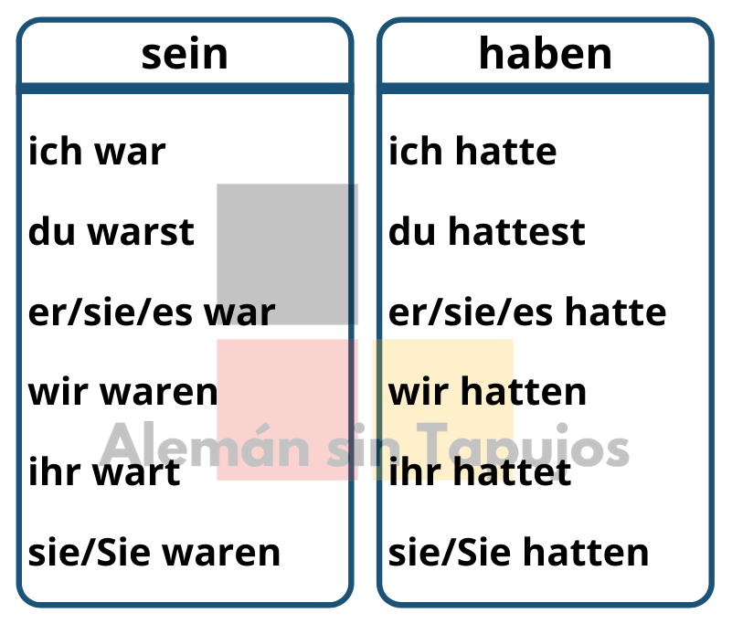


- Su uso es muy fácil, por ejemplo:

Ich hatte einen Hund, als ich ein Kind war. (Yo tenía un perro, cuando era un niño.)

- Vamos a ver también el pretérito de los verbos modales; los verbos modales nunca forman su pasado con el pasado perfecto (Perfekt)

#### El pretérito de los verbos modales
Los verbos modales en alemán forman su pasado utilizando el tiempo verbal “Präteritum”. Recordemos que los verbos modales en alemán son los siguientes:

- dürfen: poder (de permiso)
- können: poder (de habilidad)
- mögen: gustar
- müssen: tener que, deber (de obligación)
- sollen: deber (de recomendación)
- wollen: querer

Las conjugaciones en “Präteritum” de los verbos modales son las siguientes:

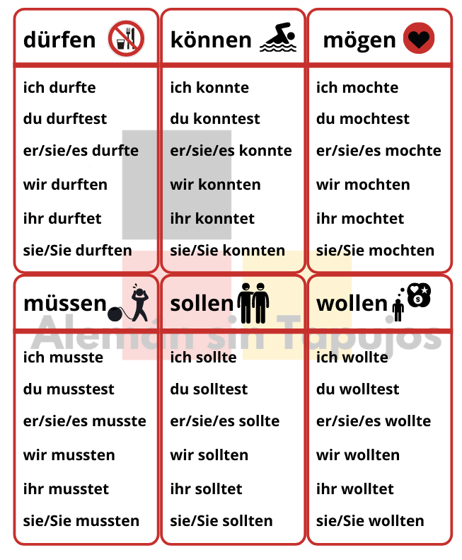

- Podemos observar como el “Präteritum” de los verbos modales sigue cierto patrón, tomamos la raíz del verbo y añadimos las siguientes terminaciones:

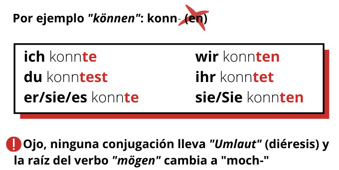

Conociendo la conjugación de los verbos auxiliares en pretérito y de los verbos modales, tendremos suficiente. Ya que utilizar el pretérito para otros verbos es muy poco común y se va aprendiendo con el tiempo y el uso.

_______________________________


## Futur I (El futuro I)
El “Futur I” es la forma verbal más frecuente en alemán para expresar un suceso futuro. Y equivale al futuro simple en español.

La construcción del “Futur I” es muy sencilla y se realiza utilizando el verbo auxiliar irregular “werden” el cual no tiene un traducción concreta y es muy utilizado en este idioma. Es decir, el verbo “werden” no tiene un significado concreto, adquiere un significado con el verbo de referencia. La estructura es la siguiente:

```Sujeto + verbo “werden” (conjugado con el sujeto) + complementos + verbo en infinitivo```

Por ejemplo:

- “Ich werde übermorgen arbeiten.” (Trabajaré pasado mañana.)

###  El Futuro en Alemán (Futur I)

Para expresarnos en un idioma de forma correcta es de vital importancia conocer todos sus tiempos verbales⏰En el post de hoy vamos a hablar de futuro simple en alemán. Espero que les guste.
El futuro se utiliza para expresar un suceso que existirá o sucederá en un tiempo posterior al presente.

En lenguaje coloquial lo común es el expresar el futuro en presente añadiendo un adverbio temporal o un aclaratorio de futuro, por ejemplo:

- Am Samstag gehe ich zum Supermarkt. (El sábado voy al supermercado.)

El sábado es el futuro y no hemos necesitado utilizar el tiempo verbal “futuro”, indicando un día futuro es suficiente.

Una vez dicho esto, vamos a hablar de los tiempos verbales propiamente dichos que expresan futuro en alemán.

En el post de hoy aprenderemos a utilizar el “Futur I” (Futuro I)

Futur I (Futur I)

El “Futur I” es la forma verbal más frecuente en alemán para expresar un suceso futuro. Y equivale al futuro simple en español.

La construcción del “Futur I” es muy sencilla y se realiza utilizando el verbo auxiliar irregular “werden“ el cual no tiene un traducción concreta y es muy utilizado en este idioma. Es decir, el verbo “werden“ no tiene un significado concreto, adquiere un significado con el verbo de referencia.

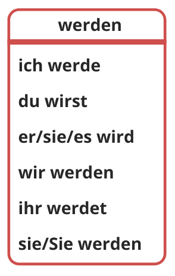


La estructura que utilizaremos para elaborar una oración en “Futur I” es la siguiente:

```
Sujeto + verbo “werden” (conjugado con el sujeto) + complementos + verbo en infinitivo
```

Vamos a ver varias frases de ejemplo:

- Ich werde morgen nach Deutschland fliegen. (Mañana volaré a Alemania.)
- Ich werde übermorgen arbeiten. (Trabajaré pasado mañana.)

Como podemos ver la formación del futuro es muy fácil, tan solo hemos de parender el verbo “werden” y conocer la estructura.

_________________

## Futur II (El futuro II)
El “Futur II” o futuro compuesto en alemán equivale al futuro perfecto o compuesto del idioma español, es decir, se corresponde con frases como: “Yo habré acabado mañana”. Es decir, el futuro II se utiliza en alemán para expresar:

Sucesos que acabarán en el futuro (yo habré acabado mañana)
Expresar una suposición del pasado (yo habré acabado los estudios)
¿Cómo se construyen estas frases en alemán? Vamos a ver la estructura:

```Sujeto + verbo “werden” (conjugado con el sujeto) + participio del verbo de la oración + “haben” o “sein” sin conjugar```

Vamos a ver ejemplos:

- “Sie wird morgen angekommen sein.” (Ella habrá llegado mañana). Es un suceso que acabará en el futuro. El verbo separable “ankommen” forma su “Perfekt” utilizando el verbo auxiliar “sein”, por eso en esta oración usamos “sein”.
- “Wenn du ankommst, werden wir gegessen haben.” (Cuando tú llegues, nosotros habremos comido). El verbo “essen” utiliza el verbo auxiliar “haben” para formar su pasado perfecto.

## Plusquamperfekt (el pluscuamperfecto)
El pretérito pluscuamperfecto se emplea en español para expresar acciones que tienen lugar con anterioridad a un determinado momento del pasado. En alemán se utiliza de manera similar al español, se utiliza para situar una acción en un momento anterior a otra, es decir, es el pasado del pasado.

- Para construir el pluscuamperfecto (Plusquamperfekt) seguiremos el siguiente esquema:

```Sujeto + verbo “haben” o “sein” en pretérito (conjugado con el sujeto) + complementos + participio del verbo de la oración```

Vamos a ver un ejemplo:

- “Ich war ins Bett gegangen, bevor meine Mutter angekommen ist.” (Yo me había ido a la cama, antes de que mi madre llegara.)

###  El pluscuamperfecto en alemán (Plusquamperfekt)
En el post de hoy vamos a estudiar uno de los tiempos verbales más avanzados en el idioma alemán y se estudia en el nivel B1. Vamos a hablar sobre él.
El pretérito pluscuamperfecto se emplea en español para expresar acciones que tienen lugar con anterioridad a un determinado momento del pasado. En alemán se utiliza de manera similar al español, se utiliza para situar una acción en un momento anterior a otra, es decir, es el pasado del pasado.

Para construir el pluscuamperfecto (Plusquamperfekt) seguiremos el siguiente esquema:

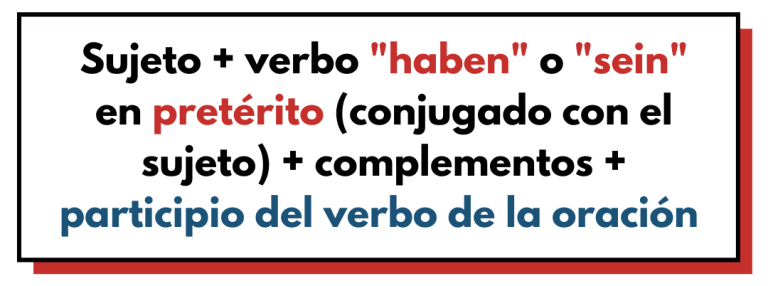

Es decir, utilizaremos el verbo auxiliar “haben” en pretérito (Präteritum) o el pretérito del verbo auxiliar “sein” en pretérito (Präteritum) según las normas de formación de el pasado perfecto “Perfekt” y el participio del verbo al final de la oración (Partizip II). Si no tienes ni idea de la formación del pasado perfecto (Perfekt) te recomiendo primero leer este post: “Perfekt”

Es un tiempo verbal más complejo y por ello hay que dominar primero el “Perfekt” y el “Präteritum”

Vamos a ver ejemplos de frases en alemán en pluscuamperfecto:

- Ich war ins Bett gegangen, bevor meine Mutter angekommen ist. (Yo me había ido a la cama, antes de que mi madre llegara.)

Vamos a analizar la frase:

Usamos el pretérito del verbo “sein” (war) porque el verbo “gehen” (participio: gegangen) utiliza como auxiliar el verbo “sein” para formar su “Perfekt”. Además está acción expresa un momento anterior antes de un determinado momento en el pasado, es el pasado del pasado. Vamos a ver otro ejemplo:

- Ich hatte dich angerufen. (Yo te había llamado.)

Utilizamos el verbo auxiliar “haben” en pretérito (hatte) , porque es el verbo auxiliar que utiliza al verbo “anrufen” (participio: angerufen) para formar su “Perfekt”.

Si no sabes consultar verbos auxiliares ni participios os recomiendo el “Conjugador reverso”

Utiliza siempre esta herramienta para consultar cualquier verbo en los diferentes tiempos verbales, consultar verbos auxiliares, participios, etc. 

______________________

## Konjuctiv I

El uso de este tiempo verbal es muy poco común. Se usa principalmente en el estilo indirecto. Un estilo indirecto es cuando el narrador comunica o expresa lo que otra persona ha dicho de modo no textual.

- Vamos a repasar conceptos

¿Cuál es la diferencia entre un estilo directo e indirecto?

El “Konjunktiv I“ es un modo verbal que se utiliza en el lenguaje periodístico y literario cuando se realizan declaraciones en estilo indirecto. Esto, en alemán, le permite al orador distanciarse de la información que transmite. 

Estilo directo: Pedro: ¡Tengo hambre!

Estilo indirecto: Pedro dice que tiene hambre.

En el estilo directo, la persona expresa directamente su intención u opinión. En cambio, en el estilo indirecto, una tercera persona comunica lo que ha dicho esta persona. Por eso, si decimos “Pedro dice que tiene hambre.” es un estilo indirecto ya que nosotros comunicamos lo que ha dicho esa persona (Pedro), no él mismo.

La pregunta es, ¿cómo es esa forma indirecta en alemán? Existe una conjugación para verbos regulares e irregulares. La conjugación para los verbos regulares es:

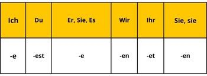


Debemos sustituir las terminaciones de los verbos del modo indicativo, por estas nuevas terminaciones para crear el “Konjunktiv I“, por ejemplo:

Alternativa 1: Pedro sagt, er habe Hunger. (Pedro dice que tiene hambre.)

Alternativa 2: Pedro sagt, dass er Hunger habe. (Pedro dice que tiene hambre.)

Vemos que usamos el pronombre “er” (él) y el verbo “haben” conjugado con una “-e” al final (habe). Esta oración no es un error, lo común es pensarlo, ya que no está conjugado en indicativo, si no en “Konjunktiv I“ y de esta forma creamos un estilo indirecto expresando la idea o lo que nos ha dicho otra persona.

Casi siempre tendremos una oración en “Konjunktiv I“ (er habe Hunger) que va acompañada de una oración principal en indicativo (Pedro dice que).

Otros ejemplos:

- Maria sagt, sie bekomme ein Fahrrad zu Weihnachten.
- Meine Schwester hat mir gesagt, dass sie jeden Morgen 5 KM laufe.
- Tim sagt, du bleibest in den Ferien hier.
- Bruno sagt, er helfe heute seinem Vater.

Somos plenamente conscientes de que puede resultar extraño ver o escuchar esta forma porque no estamos acostumbrados al “Konjunktiv I“ y puede parecer que están mal conjugados, pero no es así, simplemente es el “Konjunktiv I“.

También existen verbos irregulares como “sein”. Veamos cómo sería su conjugación en “Konjunktiv I“:

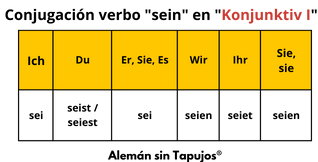

Por ejemplo:

- María Sagt, ich sei intelligent. (María dice que soy inteligente.)
- Wieso hast du gesagt, wir seien gute Fußballspieler? (¿Por qué has dicho que nosotros somos buenos jugadores de fútbol?)
- Ich habe meinem Lehrer gesagt, dass du erkältet seiest. (Le dije a mi profesor que estabas resfriado.)

En general se pueden usar todos los verbos en “Konjunktiv I“. Entre los más comunes se sitúan verbos como “erzählen”, “fragen”, “hören”, “lesen”, “vermuten”, “sein”, “haben” y “versprechen”, pero, sin duda, el más común es “sagen”🔎. Estos son los verbos más frecuentes para indicar, contar o decir lo que nos ha transmitido otra persona, igual que en español💡

Por ejemplo:

- Tim sagt, du habest Durst. (Tim dice que tienes hambre.)
- Tim sagt, du seiest in Deutschland. (Tim dice que estás en Alemania.)

La pregunta que surge es la siguiente, ¿debo usar el “Konjunktiv I“?, ¿es obligatoria? La respuesta es rotundamente “nein!” y menos mal.

En el lenguaje cotidiano, incluso entre nativos, se usa el indicativo para transmitir declaraciones de alguien. Esta forma tiene un uso muy concreto y muy restringido, por lo que recomendamos reconocer el “Konjunktiv I“, pero no es necesario saber usarlo activamente o aprenderlo ya que ni siquiera aparece en los exámenes de forma activa. Quizás pueda aparecer en la parte “Lesen” en un examen y el saber no ocupar lugar, por eso recomendamos identificarlo y saber qué es y cómo se construye, pero no recomendamos destinar mucho tiempo al estudio del “Konjunktiv I“ ya que a nivel práctico carece de importancia.

## Konjunktiv II

¿Cómo dirías en alemán “Me gustaría ser enfermera👩‍⚕️”? Para decirlo tendremos que utilizar el tiempo verbal “Konjunktiv II”, en el post de hoy vamos a expicarlo📕
El “Konjunktiv II“ en alemán se corresponde en el español con el condicional simple del indicativo. El condicional simple del indicativo se emplea en español sobre todo para expresar acciones o situaciones hipotéticas, así como preguntas en tono de cortesía o deseos, por ejemplo: desearía comprarme esos zapatos. Algo similar ocurre en el alemán.

### Usos del “Konjunktiv II“
En alemán el “Konjunktiv II“ se utiliza mayormente para:

- Para expresar deseos, sueños, fantasías, situaciones imaginarias, por ejemplo: “Ich würde gern nach Deutschland fliegen.” (Me gustaría viajar a Alemania.) “Würde“ pertenece al “Konjuntiv II“ del verbo auxiliar “werden“.
- Solicitar un servicio☕ de forma cortés, por ejemplo: “Ich würde gern eine Cola trinken.” (Querría tomar una cola.)

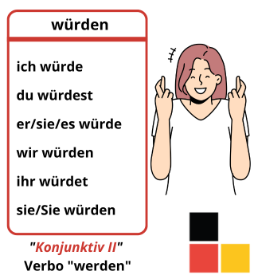

El “Konjunktiv II“ solo se usa para los verbos auxiliares (sein, haben, werden), para los verbos modales y algunos pocos verbos irregulares, por ejemplo el verbo “wissen” (saber):

- Ich wüsste nicht, was wir machen könnten. (No sabría lo que podríamos hacer.)

Recuerda que puedes consultar todos los tiempos verbales de cada verbo en un conjugador: Conjugador de verbos📌

### Vamos a ver cómo usar el “Konjunktiv II” en alemán

1. “Würde” + verbo en infinitivo

Dado que la forma original del “Konjunktiv II“ coincide en la mayoría de los verbos con el “Präteritum” se usa habitualmente la construcción “würde” + verbo en infinitivo. Vamos a verlo:

- Expresa presente o futuro, por ejemplo: “Wenn ich an deiner Stelle wäre, würde ich Deutsch lernen.” (Si yo estuviera en tu lugar, aprendería alemán.)
- Una curiosidad es que la forma “würde” + infinitivo es como la construcción del tiempo verbal “Futur I”, con el auxiliar “werden“ pero conjugado en “Konjunktiv II“, por ejemplo: “Ich würde in der Zukunft gerne ein Auto haben.” (Me gustaría en el futuro tener un coche.)

2. El “Konjunktiv II” con el verbo auxiliar “sein”

Es muy frecuente el uso del verbo auxiliar “sein” (ser o estar) en el tiempo verbal “Konjunktiv II“ para decir: “sería” o “estaría”. Vamos a verlo con ejemplos:

- Wenn ich reich wäre, würde ich mir ein Haus kaufen. (Si yo fuera rico, me compraría una casa)
- Wo wärst du jetzt gerade? (¿Dónde estarías ahora mismo?)
- Wenn ich in Deutschland wäre, wäre mir kalt. (Si estuviera en Alemania, tendría frío.)

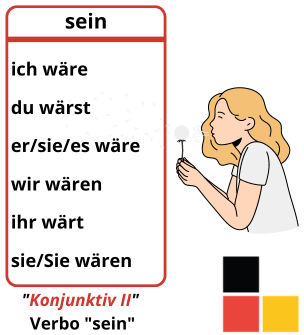

_____________________________
#### Cuándo usar “als” y cuándo usar “wenn” en alemán

En el post de hoy aprenderemos a usar bien “als” y “wenn” cuando significan “cuando” en español. Presta mucha atención al post porque su uso es sencillo pero hay que entenderlo.

Tanto “als” como “wenn” se utilizan para decir: “cuando”, pero tienen diferentes usos. Vamos a verlos:

**Als” (cuando)**
Se utiliza para referirnos al pasado y a momentos específicos en el pasado que no volverán a suceder. Por ejemplo:

- “Als ich ein Mädchen war, habe ich oft im Park gespielt.” (Cuando era niña, jugaba a menudo en el parque). Esta situación no volverá a suceder, ya que no volverá a ser una niña.

**“Wenn” (cuando, si)**

Se utiliza para momentos que se repiten, para momentos futuros o para momentos irreales (condicional con “Konjunktiv II”). Por ejemplo:

- “Wenn ich frühstücke, trinke ich immer einen Kaffee.” (Cuando desayuno, siempre me bebo un café), esta acción se puede repetir en el tiempo, puedes volver a tomar café en el desayuno.
- “Wenn du mit dem Kochen fertig bist, können wir zu Abend essen.” (Cuando hayas terminado de cocinar, podríamos cenar), es un suceso que ocurrirá en el futuro.
- “Wenn ich Zeit hätte, würde ich reisen.” (Si* tuviera tiempo, viajaría), es una situación hipotética, si tuviera tiempo, para la cual usamos el condicional (Konjunktiv II).

“Wenn” puede también traducirse por “si”, por lo cual es importante diferenciarlo de la conjunción subordinante “ob”. Esta conjunción, “ob”, significa “si” en el contexto de preguntas indirectas o mostrar duda. Esto ocurre con verbos como “fragen”, “wissen”, “erfahren”, “beantworten”, etc. Por ejemplo:

- Er hat dich gefragt, ob du ins Kino gehen möchtest. (Él te ha preguntado si tú quieres ir al cine). En esta oración mostramos duda.

- Resumiendo: es muy común confundirse en cuándo usar “wenn” y cuando “ob”. “Wenn” se utiliza para expresar un “si” condicional y “ob” se utiliza para expresar inseguridad e incertidumbre.

- Hay que tener en cuenta que tanto “als”, como “wenn”, como “ob”, funcionan como conjunciones subordinantes y la estructura sería la siguiente: 

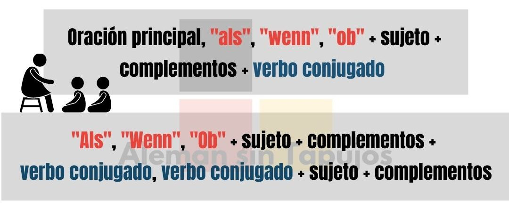

#### Resumen: Cuándo usar “wenn”, “wann”, “als” y “ob”

1. Oraciones enunciativas
wenn / immer wenn (cuando / siempre que): acciones repetidas en presente, pasado o futuro. Por ejemplo:  “Immer wenn ich frühstücke, trinke ich einen Orangensaft.” (Siempre que desayuno, tomo un zumo de naranja)
wenn (si): condicional. Por ejemplo: “Wenn ich Geld hätte, würde ich reisen.” (Si tuviera dinero, viajaría),
als (cuando): acción producida en el pasado y que no se puede volver a repetir. Por ejemplo: “Als ich klein war, habe ich Tennis gespielt.” (Cuando era pequeño, jugaba al tenis)

2. Oraciones interrogativas e indirectas
wann? (¿cuándo?): para preguntar por un momento en concreto. Por ejemplo: “Wann kommst du zurück?” (¿Cuándo vas a regresar?)
ob (si): expresa inseguridad e incertidumbre. Por ejemplo: “Ich frage mich, ob er verheiratet ist.” (Me pregunto si él está casado.)

___________________________


3. “Konjunktiv II” para solicitar un servicio

En este punto aprenderemos a solicitar un servicio en una cafetería, restaurante, panadería, frutería o cualquier lugar relacionado con este sector. En alemán se usan unos pocos verbos para pedir o solicitar un servicio. Sobre todo se utilizan estos verbos en frases hechas, por eso el significado cambia con respecto al español. Por ejemplo:

- Möchten Sie etwas bestellen? (¿Quiere usted pedir algo?)
- Ich möchte einen Tee trinken, bitte! (Quiero tomar un té, ¡gracias!)

También podemos observar cómo a veces se omite el verbo en infinitivo al final, ya que queda implícito en la frase lo que se desea, por ejemplo:

- Ich möchte einen Orangensaft.  (Me gustaría (tomar / beber) un zumo de naranja.)

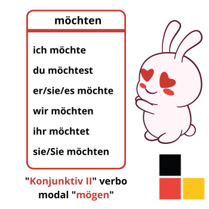

También se suele utilizar el tiempo verbal “Konjunktiv II“ del verbo “haben” para indicar que deseas algo, es una frase hecha y no tiene traducción literal al español❌. Por ejemplo:

- Was hätten Sie gern? (¿Qué desea?)
- Ich hätte gern einen Milchkaffee und ein Sandwich, bitte!  (Quiero un café con leche y un sándwich, ¡por favor!)

Ojo, porque en este caso el verbo “hätten” no se acompaña de un verbo en infinitivo al final de la frase. Se puede utilizar con un verbo al final cuando decimos por ejemplo: “tendría que”; si se acompaña del verbo “sollen”, por ejemplo: “Ich hätte bezahlen sollen.” (Tendría que haber pagado.)

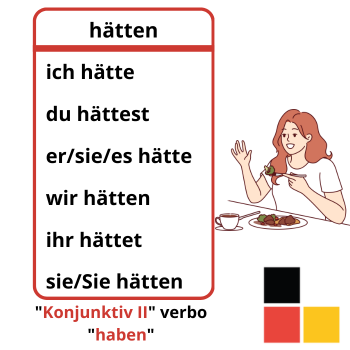

4. “Konjunktiv II” en los verbos modales (Modalverben)

Vamos a ver el tiempo verbal “Konjunktiv II” o condicional de los verbos modales. Recordemos que los verbos modales en alemán son los siguientes:

- dürfen: poder (de permiso)
- können: poder (de habilidad)
- mögen: gustar
- müssen: tener que, deber (de obligación)
- sollen: deber (de recomendación)
- wollen: querer

Las conjugaciones verbales en “Konjunktiv II“ de los verbos modales son las siguientes:

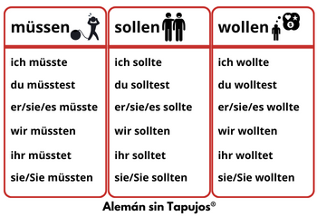

Podemos observar como el “Konjunktiv II“ de los verbos modales sigue cierto patrón, tomamos la raíz del verbo y añadimos las siguientes terminaciones:

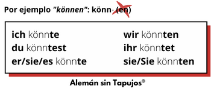

Ojo, los verbos “sollen” y “wollen” no llevan “Umlaut” (diéresis) y la raíz del verbo “mögen” cambia a “möch-“.

Aprender a utilizar el “Konjunktiv II” es de gran utilidad en el idioma alemán y marcará un salto en tu nivel de aprendizaje. Por ejemplo: “Ich sollte mehr Deutsch lernen” (Debería estudiar alemán😂)