# connect vpC

- VPC Peering: This is the simplest way to connect two VPCs. It allows you to create a direct network route between them, enabling instances in one VPC to communicate with instances in another VPC using private IP addresses.

- VPN Connection: You can establish a VPN (Virtual Private Network) connection between two VPCs, or between a VPC and your on-premises network. This provides a secure encrypted connection over the internet.

- AWS Direct Connect: This is a dedicated network connection between your on-premises data center and AWS. You can use Direct Connect to establish private connectivity between your VPCs and your on-premises infrastructure.

- Transit Gateway: Transit Gateway is a service that simplifies network connectivity between VPCs, VPNs, and Direct Connect. It acts as a hub that allows you to connect multiple VPCs and on-premises networks.

- AWS Managed VPN: AWS Managed VPN is a fully managed VPN service provided by AWS. It simplifies the setup and management of VPN connections between your VPCs and your on-premises network.

# VPC components

Virtual Private Cloud (VPC) consists of several components:

- Subnets: Divisions within the VPC where you can place resources. They are associated with a specific availability zone.
- Route Tables: Defines where network traffic is directed. Each subnet is associated with a route table.
- Internet Gateway (IGW): Allows communication between instances in your VPC and the internet.
- NAT Gateway/NAT Instance: Allows instances in a private subnet to initiate outbound traffic to the internet while preventing inbound traffic from reaching those instances.
- Security Groups: Acts as a virtual firewall for your instances to control inbound and outbound traffic.
- Network Access Control Lists (ACLs): A set of rules that control traffic coming in and out of your subnets. They operate at the subnet level.
- VPC Peering: Allows you to connect one VPC with another via a direct network route using private IP addresses.

https://docs.aws.amazon.com/whitepapers/latest/aws-vpc-connectivity-options/amazon-vpc-to-amazon-vpc-connectivity-options.html

## VPC peering

A VPC peering connection is a networking connection between two VPCs that enables routing using each VPC’s private IP addresses as if they were in the same network. VPC peering connections can be created between your own VPCs or with a VPC in another AWS account. VPC peering also supports inter-region peering.

Traffic using inter-region VPC Peering always stays on the global AWS backbone and never traverses the public internet, thereby reducing threat vectors, such as common exploits and DDoS attacks.

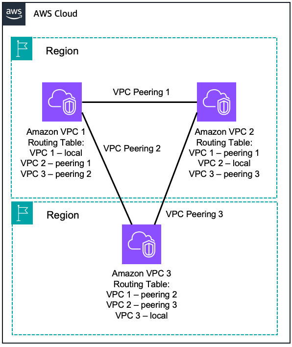

## AWS Transit Gateway

AWS Transit Gateway is a highly available and scalable service to consolidate the AWS VPC routing configuration for a region with a hub-and-spoke architecture. Each spoke VPC only needs to connect to the Transit Gateway to gain access to other connected VPCs. Both IPv4 and IPv6 traffic is supported in AWS Transit Gateway.

Transit Gateways can be peered with each other within the same AWS Region or between different AWS Regions. AWS Transit Gateway traffic always stays on the global AWS backbone and never traverses the public internet, thereby reducing threat vectors such as common exploits and DDoS attacks.

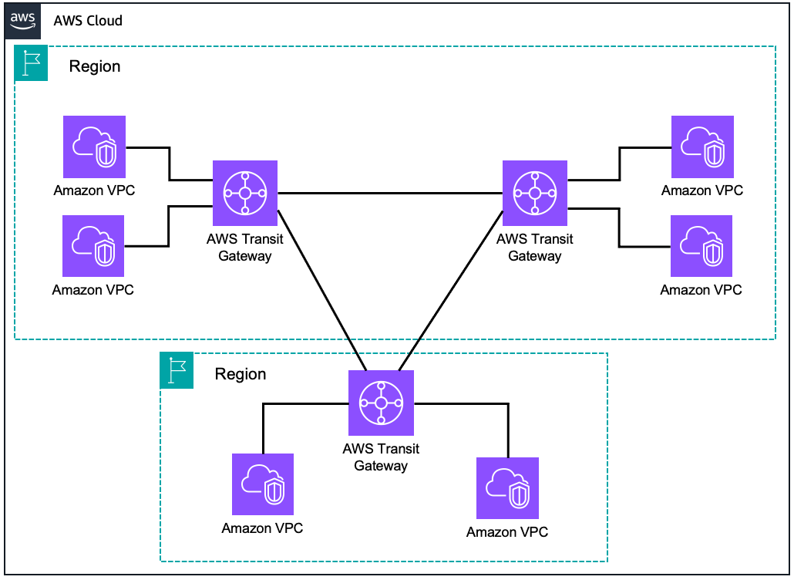

## AWS PrivaLink

AWS PrivateLink enables you to connect to some AWS services, services hosted by other AWS accounts (referred to as endpoint services), and supported AWS Marketplace partner services, via private IP addresses in your VPC. The interface endpoints are created directly inside of your VPC, using elastic network interfaces and IP addresses in your VPC’s subnets. That means that VPC Security Groups can be used to manage access to the endpoints.

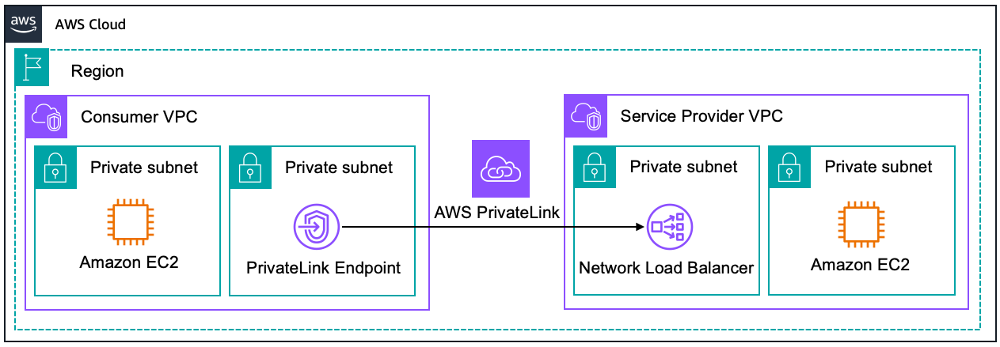

## Software VPN

Amazon VPC provides network routing flexibility. This includes the ability to create secure VPN tunnels between two or more software VPN appliances to connect multiple VPCs into a larger virtual private network so that instances in each VPC can seamlessly connect to each other using private IP addresses. This option is recommended when you want to manage both ends of the VPN connection using your preferred VPN software provider. This option uses an internet gateway attached to each VPC to facilitate communication between the software VPN appliances.

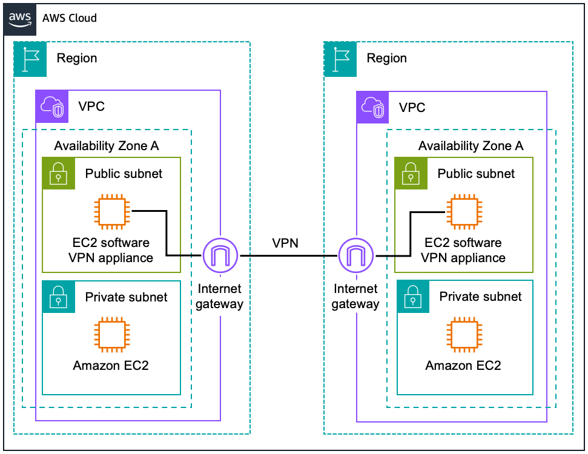

## Software VPN-to-AWS Site-to-Site VPN

Amazon VPC provides the flexibility to combine the AWS managed VPN and software VPN options to connect multiple VPCs. With this design, you can create secure VPN tunnels between a software VPN appliance and a virtual private gateway, allowing instances in each VPC to seamlessly connect to each other using private IP addresses. This option uses a virtual private gateway in one Amazon VPC and a combination of an internet gateway and software VPN appliance in another Amazon VPC, as shown in the following figure.

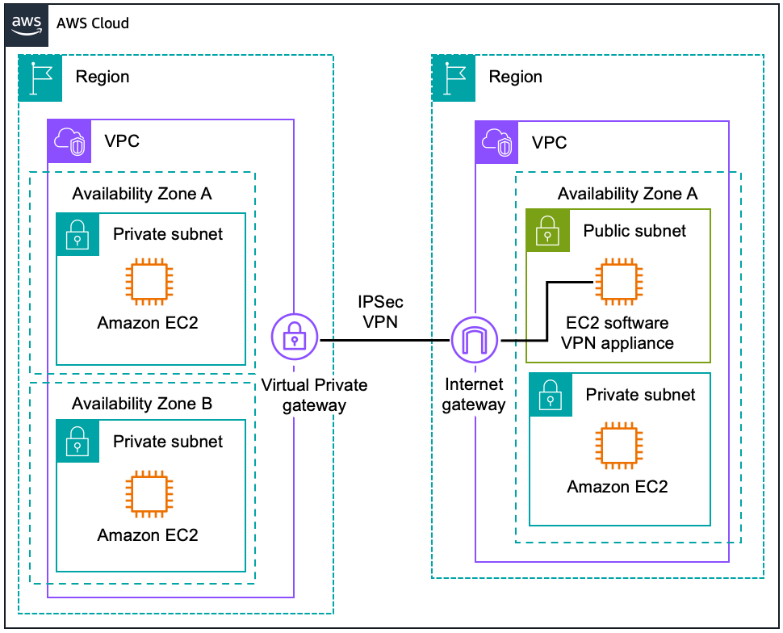

_______________________________________

https://docs.aws.amazon.com/whitepapers/latest/aws-vpc-connectivity-options/aws-site-to-site-vpn.html

## AWS Site-to-Site VPN

Amazon VPC provides the option of creating an IPsec VPN connection between your remote networks and Amazon VPC over the internet, as shown in the following figure.

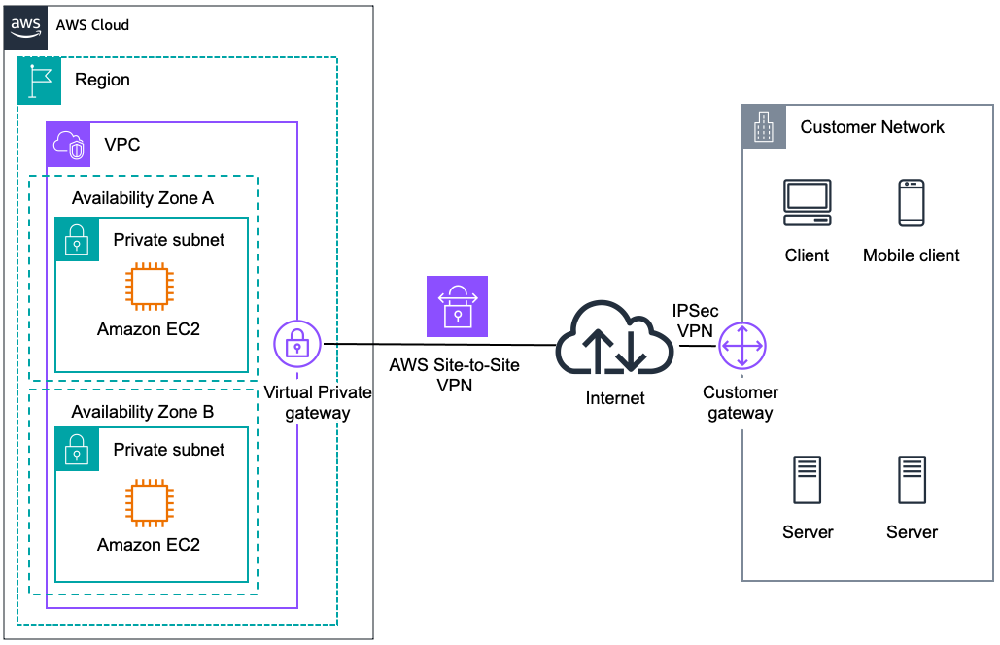

Consider taking this approach when you want to take advantage of an AWS-managed VPN endpoint that includes automated redundancy and failover built into the AWS side of the VPN connection.

The virtual private gateway also supports and encourages multiple user gateway connections so that you can implement redundancy and failover on your side of the VPN connection, as shown in the following figure.

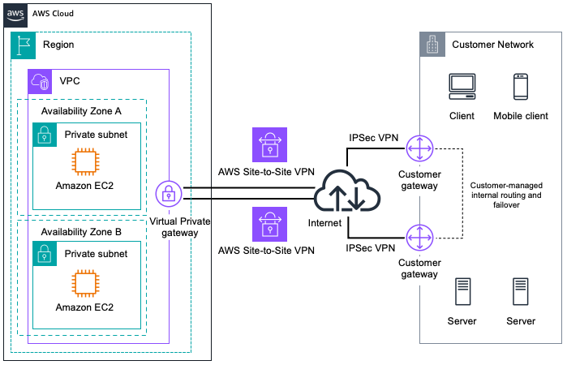

Both dynamic and static routing options are provided to give you flexibility in your routing configuration. Dynamic routing uses BGP peering to exchange routing information between AWS and these remote endpoints. With dynamic routing, you can also specify routing priorities, policies, and weights (metrics) in your BGP advertisements and influence the network path between your networks and AWS. It’s important to note that when you use BGP, both the IPsec and the BGP sessions must be terminated on the same user gateway device, so it must be capable of terminating both IPsec and BGP sessions.

## AWS Transit Gateway + AWS Site-to-Site VPN

AWS Transit Gateway is an AWS managed high availability and scalability regional network transit hub used to interconnect VPCs and customer networks. AWS Transit Gateway + VPN, using the Transit Gateway VPN attachment, provides the option of creating an IPsec VPN connection between your remote network and the Transit Gateway over the internet, as shown in the following figure.

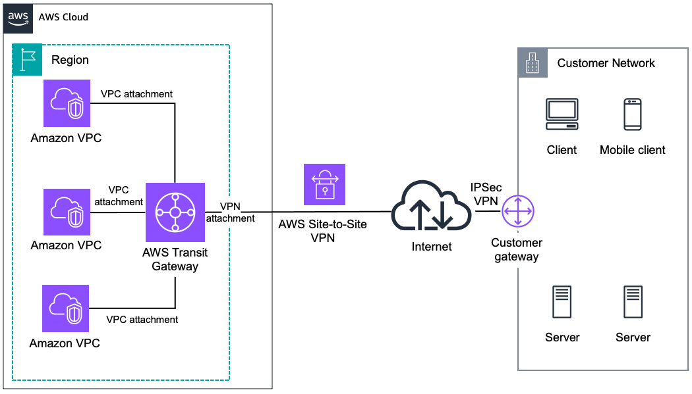

Consider using this approach when you want to take advantage of an AWS-managed VPN endpoint for connecting to multiple VPCs in the same region without the additional cost and management of multiple IPsec VPN connections to multiple Amazon VPCs.

AWS Transit Gateway also supports and encourages multiple user gateway connections so that you can implement redundancy and failover on your side of the VPN connection as shown in the following figure.

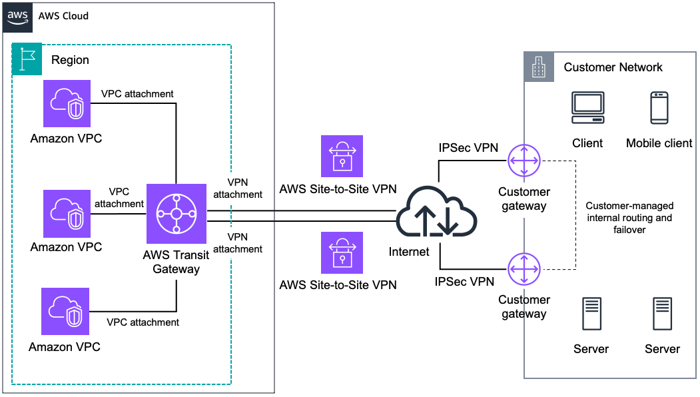

In addition, you can enable acceleration in your AWS Site-to-Site VPN connections. An accelerated VPN connection uses AWS Global Accelerator to route traffic from your network to an AWS edge location that is closest to your customer gateway device. You can use this option to avoid network disruptions that might occur when the traffic is routed over the public internet. Acceleration is only supported for VPN connections that are attached to a Transit Gateway, as shown in the following figure:

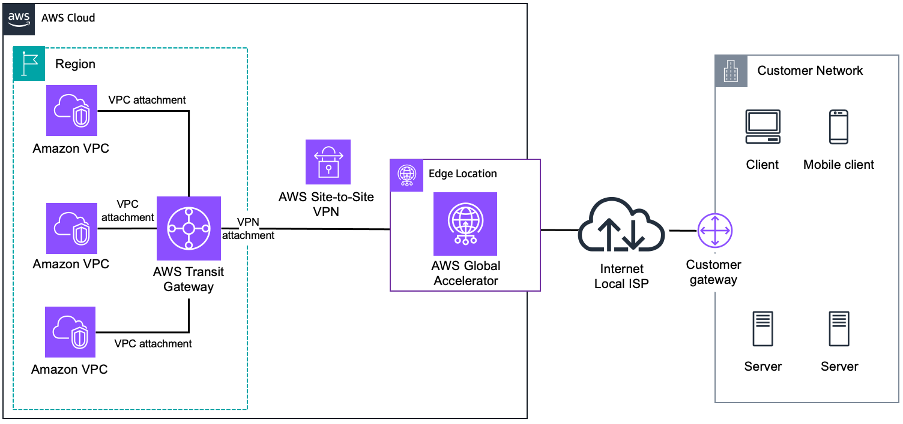

IPv6 is only supported for the inside IP addresses of the VPN tunnel. The outside IP address for the AWS endpoints are public IPv4 addresses. The customer gateway IP address should be a public IPv4 address.

A Site-to-Site VPN connection cannot support both IPv4 and IPv6 traffic. If your hybrid connectivity requires dual-stack communication, you should create different VPN tunnels for the IPv4 and IPv6 traffic.

## AWS Direct Connect

AWS Direct Connect makes it easy to establish a dedicated connection from an on-premises network to one or more VPCs. AWS Direct Connect can reduce network costs, increase bandwidth throughput, and provide a more consistent network experience than internet-based connections. It uses industry-standard 802.1Q VLANs to connect to Amazon VPC using private IP addresses. The VLANs are configured using virtual interfaces (VIFs), and you can configure three different types of VIFs:

Public virtual interface - Establish connectivity between AWS public endpoints and your data center, office, or colocation environment.

Transit virtual interface - Establish private connectivity between AWS Transit Gateway and your data center, office, or colocation environment. This connectivity option is covered in the section AWS Direct Connect + AWS Transit Gateway.

Private virtual interface - Establish private connectivity between Amazon VPC resources and your data center, office, or colocation environment. The use of private VIFs is shown in the following figure.

You can establish connectivity to the AWS backbone using AWS Direct Connect by establishing a cross-connect to AWS devices in a Direct Connect location. You can access any AWS Region from any of our Direct Connect locations (except China). If you don’t have equipment at a location, you can choose from an ecosystem of WAN service providers for integrating your AWS Direct Connect endpoint in an AWS Direct Connect location with your remote networks.

With AWS Direct Connect, you have two types of connection:

Dedicated connections, where a physical ethernet connection is associated with a single customer. You can order port speeds of 1, 10, or 100 Gbps. You might need to work with a partner in the AWS Direct Connect Partner Program to help you establish network circuits between an AWS Direct Connect connection and your data center, office, or colocation environment.

Hosted connections, where a physical ethernet connection is provisioned by an AWS Direct Connect Partner and shared with you. You can order port speeds between 50 Mbps and 10 Gbps. Your work with the Partner in both the AWS Direct Connect connection they established and the network circuits between an AWS Direct Connect connection and your data center, office, or colocation environment.

## AWS Direct Connect + AWS Transit Gateway

AWS Direct Connect + AWS Transit Gateway, using transit VIF attachment to Direct Connect gateway, enables your network to connect several regional centralized routers over a private dedicated connection. The following diagram shows connecting to two routers.

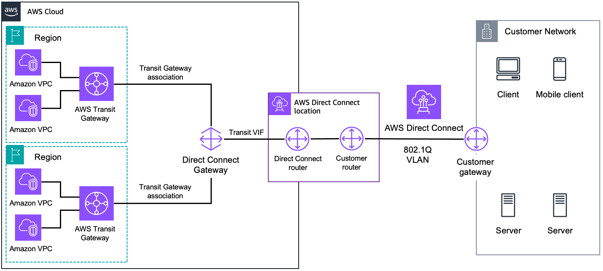

Each AWS Transit Gateway is a network transit hub to interconnect VPCs in the same region, consolidating Amazon VPC routing configuration in one place. This solution simplifies management of connections between an Amazon VPC and your networks over a private connection that can reduce network costs, increase bandwidth throughput, and provide a more consistent network experience than internet-based connections.

## AWS Direct Connect + AWS Site-to-Site VPN

With AWS Direct Connect + AWS Site-to-Site VPN, you can combine AWS Direct Connect connections with an AWS-managed VPN solution. AWS Direct Connect public VIFs establish a dedicated network connection between your network and public AWS resources such as an AWS Site-to-Site VPN endpoint. Once you establish the connection to the service, you can create IPsec connections to the corresponding Amazon VPC virtual private gateways. The following figure illustrates this option.

This solution combines the benefits of the end-to-end secure IPsec connection with low latency and increased bandwidth of the AWS Direct Connect to provide a more consistent network experience than internet-based VPN connections. A BGP connection session is established between AWS Direct Connect and your router on the public VIF. Another BGP session or a static route will be established between the virtual private gateway and your router on the IPsec VPN tunnels.

## AWS Direct Connect + AWS Transit Gateway + AWS Site-to-Site VPN

With AWS Direct Connect + AWS Transit Gateway + AWS Site-to-Site VPN, you can enable end-to-end IPsec-encrypted connections between your networks and a regional centralized router for Amazon VPCs over a private dedicated connection.

You can use AWS Direct Connect public VIFs to first establish a dedicated network connection between your network to public AWS resources, such as AWS Site-to-Site VPN endpoints. Once this connection is established, you can create an IPsec connection to AWS Transit Gateway. The following figure illustrates this option.

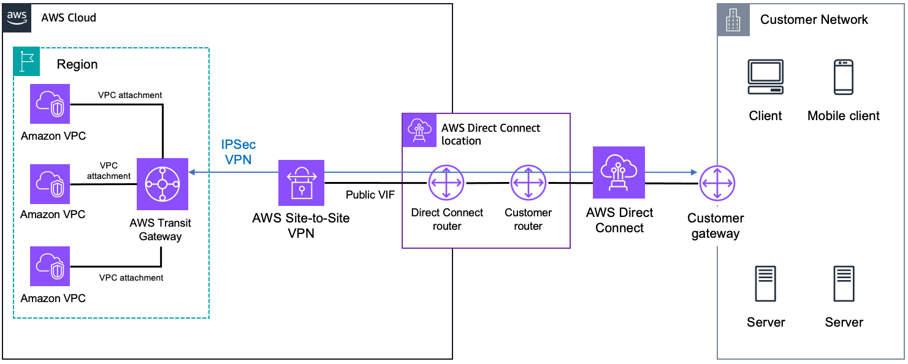

AWS Direct Connect, AWS Transit Gateway, and AWS Site-to-Site VPN (public VIF)

Consider taking this approach when you want to simplify management and minimize the cost of IPsec VPN connections to multiple Amazon VPCs in the same region, with the low latency and consistent network experience benefits of a private dedicated connection over an internet-based VPN. A BGP session is established between AWS Direct Connect and your router using either the public or the transit VIF. Another BGP session or a static route will be established between AWS Transit Gateway and your router on the IPsec VPN tunnel.

## AWS VPN CloudHub

Building on the AWS managed VPN options described previously, you can securely communicate from one site to another using the AWS VPN CloudHub. The AWS VPN CloudHub operates on a simple hub-and-spoke model that you can use with or without a VPC. Use this approach if you have multiple branch offices and existing internet connections and would like to implement a convenient, potentially low-cost hub-and-spoke model for primary or backup connectivity between these remote offices.

The following figure shows the AWS VPN CloudHub architecture, with lines indicating network traffic between remote sites being routed over their AWS VPN connections.

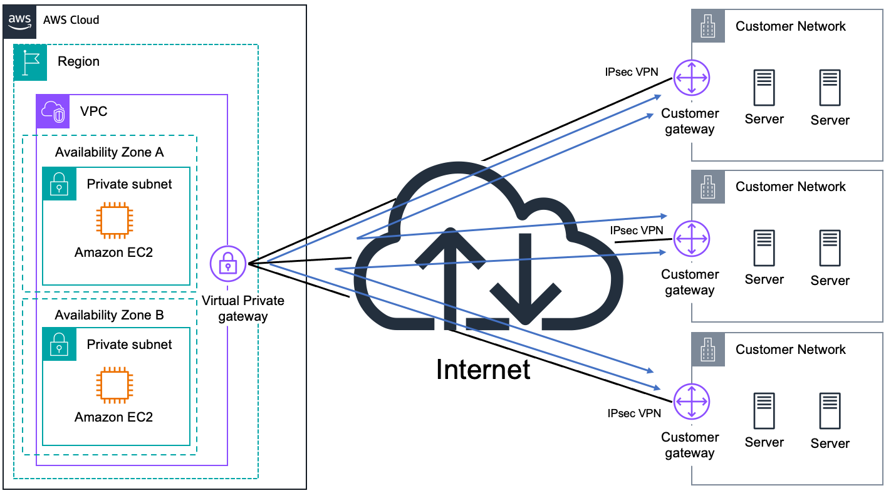

AWS VPN CloudHub uses an Amazon VPC virtual private gateway with multiple customer gateways, each using unique BGP autonomous system numbers (ASNs). The remote sites must not have overlapping IP ranges. Your gateways advertise the appropriate routes (BGP prefixes) over their VPN connections. These routing advertisements are received and re-advertised to each BGP peer so that each site can send data to and receive data from the other sites.

## AWS Transit Gateway + SD-WAN solutions

Software Defined Wide Area Networks (SD-WANs) are used to connect your data centers, offices, or colocation environments over different transit networks (such as the public internet, MPLS networks, or the AWS backbone using AWS Direct Connect), managing the traffic automatically and dynamically across the most appropriate and efficient path based on network conditions, application type or quality of service (QoS) requirements.

Use this approach if you have a complex network topology, with several data centers, offices, or colocation environments that need to communicate between themselves and with AWS. SD-WAN solutions can help you to efficiently manage this type of network.

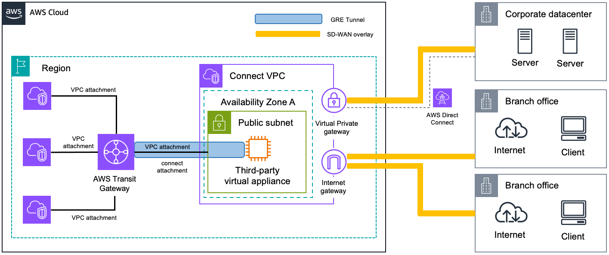

## Software VPN

Amazon VPC offers you the flexibility to fully manage both sides of your Amazon VPC connectivity by creating a VPN connection between your remote network and a software VPN appliance running in your Amazon VPC network. This option is recommended if you must manage both ends of the VPN connection, either for compliance purposes or for leveraging gateway devices that are not currently supported by Amazon VPC’s VPN solution. The following figure shows this option.

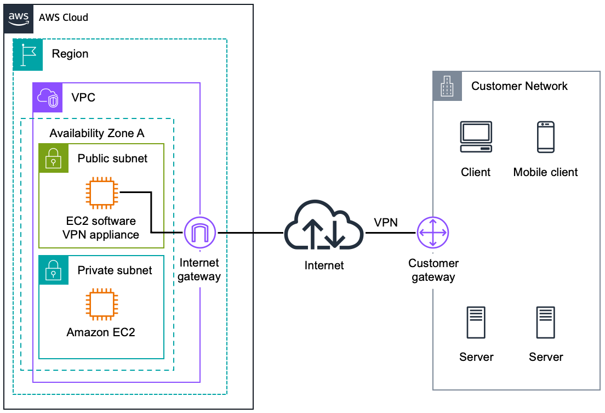

You can choose from an ecosystem of multiple partners and open-source communities that have produced software VPN appliances that run on Amazon EC2. Along with this choice comes the responsibility that you must manage the software appliance, including configuration, patches, and upgrades.

Note that this design introduces a potential single point of failure into the network design because the software VPN appliance runs on a single Amazon EC2 instance. For additional information, see Appendix A: High-Level HA architecture for software VPN instances Architecture for Software VPN Instances.

