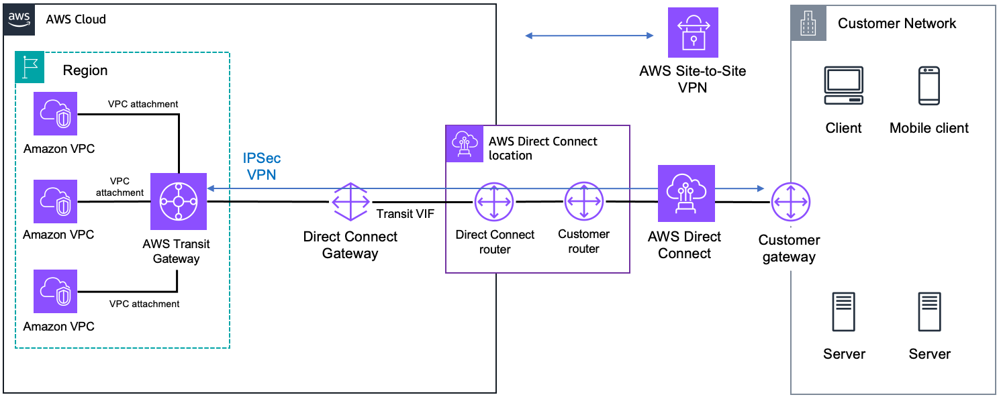

# Terraform


the primary purpose of terraform state is to store bindings between objects in a remote system and resource instances declared in your configuration

Import comand

import block terraform 1.5

importar recursos existentes a terraform

https://www.youtube.com/watch?v=znfh_00EDZ0

https://spacelift.io/blog/importing-exisiting-infrastructure-into-terraform

https://www.youtube.com/watch?v=JcV4nvG8vmU


azure: azure terrafy
AWS: terraformer, firefly (cost)

____________

## terraform import

Getting the pre-existing cloud resources under the Terraform management is facilitated by Terraform import. import is a Terraform CLI command which is used to read real-world infrastructure and update the state, so that future updates to the same set of infrastructure can be applied via IaC.

As discussed earlier, Terraform import does not generate the configuration files by itself. Thus, you need to create the corresponding configuration for the resource manually. This doesn’t need many arguments as we will have to add or modify them when we import the EC2 instance into our state file.

Think of it as if the cloud resource (EC2 instance) and its corresponding configuration were available in our files. All that’s left to do is to map the two into our state file. We do that by running the import command as follows.

```
terraform import aws_instance.myvm <Instance ID>
```

Please notice that the directory now also contains terraform.tfstate file. This file was generated after the import command was successfully run. Take a moment to go through the contents of this file.

Right now our configuration does not reflect all the attributes. Any attempt to plan/apply this configuration will fail because we have not adjusted the values of its attributes. To close the gap in configuration files and state files, run terraform plan and observe the output.

Improve config to avoid replacement
At this point, it is important to understand that the terraform.tfstate file is a vital piece of reference for Terraform. All of its future operations are performed with consideration for this state file. You need to investigate the state file and update your configuration accordingly so that there is a minimum difference between them.

The use of the word “minimum” is intentional here. Right now, you need to focus on not replacing the given EC2 instance but rather aligning the configuration so that the replacement can be avoided. Eventually, you would achieve a state of 0 difference.

Run terraform plan again, and observe the output.

If you have the same output (No changes), congratulations, as you have successfully imported a cloud resource into your Terraform config. It is now possible to manage this configuration via Terraform directly, without any surprises.

## import block (terraform 1.5)

In Terraform 1.5, a new import mechanism is available. A new top-level import block can be defined in your code to allow import operations. As this block is added in the code, import will not be a state operation, from now on, as for every other resource, it becomes a plannable operation. 



The import block, as you can see above, takes two parameters:

id → The id of the resource used in your cloud provider
to → The resource address that will be used in Terraform

Next, if you want to generate the configuration automatically, you can run the following command:

terraform plan -generate-config-out=generated_resources.tf


## terraform taint:

The terraform taint command is useful in scenarios where a resource becomes corrupted or is in an unknown state, and you want Terraform to manage it as if it were a new resource. By tainting the resource, you ensure that Terraform will recreate it during the next apply operation, bringing it back to a known and consistent state.

**Uso:**
```bash
terraform taint nombre_del_recurso
```

**Ejemplo:**
Supongamos que tenemos un recurso `aws_instance` que queremos marcar como "tainted":
```bash
terraform taint aws_instance.example
```

En resumen, `terraform taint` se utiliza para marcar recursos específicos como "tainted" y `terraform destroy` se utiliza para destruir todos los recursos administrados por Terraform según la configuración actual. Ambos comandos son útiles para administrar y mantener la infraestructura de manera eficiente y segura.

___________________
## Questions 
Q1: Suppose you created an ec2 instance with terraform and after creation, you have removed the entry from the state file now, when you run terraform apply what will happen?

As we have removed the entry from that state file so terraform will no longer manage that resource so on the next apply it will create a new resource.

Q2: What is a state file in Terraform?

A state file is a file in which Terraform keeps track of all the infrastructure that is deployed by it.

Q3: What is the best way to store the terraform state file?

The best way to store the state file is to keep it in the remote backend like S3 or GitLab-managed terraform state so, that whenever multiple people are working on the same code resource duplication won’t happen.

Q4: What is terraform state locking?

Whenever we are working on any terraform code and do terraform plan, apply or destroy terraform will lock the state file in order to prevent the destructive action.

Q5: What is Terraform backend?

A backend defines where Terraform stores its state data files. Terraform uses persisted state data to keep track of the resources it manages.

Q6: What is a plugin in Terraform?

The plugin is responsible for converting the HCL code into API calls and sends the request to the appropriate provider (AWS, GCP)

Q7: What is a null resource?


In Terraform, a null_resource is a resource that doesn't actually represent an infrastructure object like most other resources. Instead, it's a way to define a placeholder resource that can be used to execute arbitrary actions or commands outside of the typical resource lifecycle.

You can use a null_resource to define custom actions or tasks that are not directly supported by Terraform's built-in resource types. This can include running scripts, executing commands on a remote server, or interacting with external systems.

```
resource "null_resource" "example" {
  # Define triggers to force recreation of the null_resource
  triggers = {
    always_run = "${timestamp()}"
  }

  # Execute a local script
  provisioner "local-exec" {
    command = "echo Hello, Terraform!"
  }
}

```

Q8: What are the types of provisioners?

Remote exec: Run commands using Terraform on a remote server
Local exec: Run commands using Terraform on the local system

Q9: What is the use of Terraform module?

A Terraform module is a collection of standard configuration files in a dedicated directory. Terraform modules encapsulate groups of resources dedicated to one task, reducing the amount of code you have to develop for similar infrastructure components.

We can create the terraform modules one time and reuse them whenever needed
To make to code standardized
To reduce the code duplication
The module can be versioned

Q10: If I have created EC2 and VPC using Terraform and unfortunately tfstate file got deleted, can you recover it? (File is only on the local machine not on s3 or dynamo DB)

You can import the resources that are created by Terraform using terraform import command and then it will come to the state file

Q11: If we have created different-different modules like VPC, EC2, security group, access key, and subnet so how terraform will get an idea of which resource should deploy first?

Terraform automatically figures out the dependency graph based on the resource references in your code. It understands the relationships between resources, and it uses this information to determine the order in which the resources should be created or modified.
You can define the explicit dependency with the depends_on keyword

Q12: How I can delete/destroy specific resources without changing logic?

Using taint and destroy command
We need to taint that resource using terraform taint RESOURCE_TYPE.RESOURCE_NAME command
After tainting the resource, you can run the “destroy” command to remove the tainted resources using terraform destroy -target=RESOURCE_TYPE.RESOURCE_NAME command

Q13: How can we rename a resource in Terraform without deleting it?

We can rename a resource without deleting it using terraform mv command

The terraform mv command in Terraform is used to move and rename resources within your Terraform configuration files without actually modifying the infrastructure it manages. It allows you to update your Terraform configuration to reflect changes in the structure of your infrastructure, such as renaming resources or moving them to different locations, without causing Terraform to destroy and recreate the resources.

```
terraform mv aws_instance.example aws_instance.new_example

```

Q14: Let’s say you have created an EC2 instance using Terraform and someone does the manual change on it next time you run Terraform plan what will happen?

Terraform state will be mismatched and terraform will modify the EC2 instance to the desired state i.e. whatever we have defined in the .tf file

Q15: What is the difference between locals & variables in terraform?

The variables are defined in the variables.tf file or using variables keyword that can be overridden but the locals can not be overridden.
So if you want to restrict the overriding the variables at that time you need to use the locals.


# Terraform ligecycle hoooks

In Terraform, lifecycle hooks are a feature used to control when resources are created, updated, or destroyed based on changes in other resources. They allow you to specify dependencies between resources and define actions to be taken before or after certain operations.

There are three main types of lifecycle hooks in Terraform:

create_before_destroy: This lifecycle hook ensures that a new resource is created before the old one is destroyed during an update. It helps prevent downtime by ensuring that the new resource is ready to handle traffic before the old one is taken offline. This is commonly used for resources that cannot be updated in place without downtime.Example:

```
resource "aws_instance" "example" {
  # ...

  lifecycle {
    create_before_destroy = true
  }
}

```

prevent_destroy: This lifecycle hook prevents a resource from being destroyed when its configuration is removed from Terraform's configuration. It can be useful for preventing accidental deletion of critical resources.Example:

```
resource "aws_instance" "example" {
  # ...

  lifecycle {
    prevent_destroy = true
  }
}

```
ignore_changes: This lifecycle hook allows you to specify attributes of a resource that Terraform should ignore when determining whether the resource needs to be updated. It can be used to prevent unnecessary updates to certain attributes of a resource.Example:

```
resource "aws_instance" "example" {
  # ...

  lifecycle {
    ignore_changes = [
      # List of attributes to ignore
      "tags",
      "metadata",
    ]
  }
}

```

These lifecycle hooks provide fine-grained control over resource management in Terraform, allowing you to define dependencies, prevent accidental destruction, and control when updates occur. They are especially useful in complex infrastructure scenarios where resource dependencies and update strategies need to be carefully managed.

